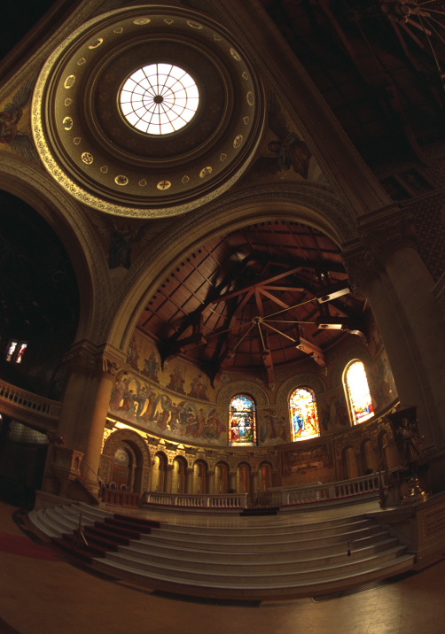
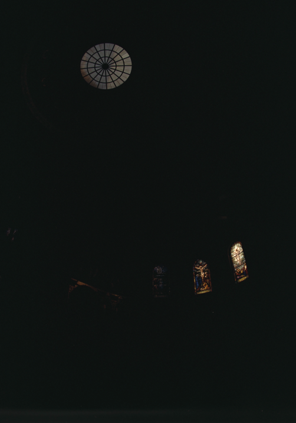
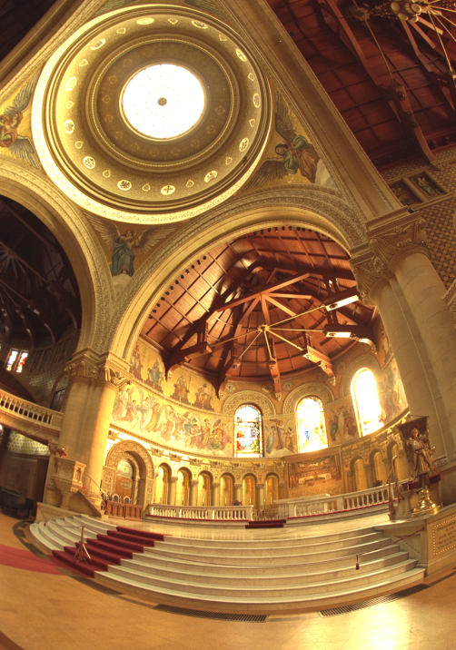

# CS 180 Final Project
Junye Wang 3040815937  Chuyan Zhou 3040814117

# Project 1: High Dynamic Range

    

        
        
        
        
        
        
        
        
    

    

        
        
        
        
        
        
        
        
    

## Background
Modern cameras are unable to capture the full dynamic range of commonly encountered real-world scenes. In some scenes, even the best possible photograph will be partially under or over-exposed. Researchers and photographers commonly get around this limitation by combining information from multiple exposures of the same scene. You will write software to automatically combine multiple exposures into a single high dynamic range radiance map, and then convert this radiance map to an image suitable for display through tone mapping.

There are two major components to this project:
- Recovering a radiance map from a collection of images
- Converting this radiance map into a display image

## Part 1: Radiance map construction

### 1. Stage 1: Film Response Recovery (g solve)
- $$g(Z)$$: response curve to be recovered
- $$Z$$: pixel value (N_pixels x N_images)
- $$\lambda$$: smoothness parameter

$$g(Z_{ij}) = \ln E_i + \ln \Delta t_j$$

Our goal is to minimize the following quadratic ob-
jective function:

$$O = \sum_{i=1}^{N}\sum_{j=1}^{P} [g(Z_{ij}) - \ln E_i - \ln \Delta t_j]^2 + \lambda \sum_{z=Z_{\text{min}}+1}^{Z_{\text{max}}-1} [g''(z)]^2$$

Weighting function:
$$
w(z) =
\begin{cases}
z - Z_{\text{min}}, & \text{if } z \leq \frac{1}{2}(Z_{\text{min}} + Z_{\text{max}}) \\
Z_{\text{max}} - z, & \text{if } z > \frac{1}{2}(Z_{\text{min}} + Z_{\text{max}})
\end{cases}
$$

## Stage 2: Constructing the High Dynamic Range Radiance Map
Once the response curve $$g$$ is recovered, it can be used to quickly convert pixel values to relative radiance values.

$$
\ln E_i = g(Z_{ij}) - \ln \Delta t_j
$$

$$
\ln E_i = \frac{\sum_{j=1}^{P} w(Z_{ij})(g(Z_{ij}) - \ln \Delta t_j)}{\sum_{j=1}^{P} w(Z_{ij})}
$$

    

        
        
HDR Output

    

    

        
        
Radiance Map

    

## Part 2: Tone mapping

1. **Compute Intensity (I)**  
   Calculate the intensity by averaging the color channels:
   $$ I = \frac{R + G + B}{3} $$

2. **Compute Chrominance Channels**  
   Normalize the color channels with respect to the intensity:
   $$ R/I, G/I, B/I $$

3. **Log Intensity Calculation**  
   Transform the intensity into the logarithmic domain:
   $$ L = \log_2(I) $$

4. **Bilateral Filtering**  
   Apply a bilateral filter to smooth the log intensity while preserving edges:
   $$ B = bf(L) $$

5. **Detail Layer Extraction**  
   Subtract the filtered base from the log intensity to isolate details:
   $$ D = L - B $$

6. **Base Adjustment**  
   Adjust the base layer with an offset and scale:
   $$ B' = (B - o) * s $$
   
   Where:
   - The offset `o` is set such that the maximum intensity of the base is 1, since the values are in the log domain:
     $$ o = max(B) $$
   - The scale `s` is determined to cover a dynamic range of `dR` stops:
     $$ s = \frac{dR}{max(B) - min(B)} $$

7. **Reconstruct Log Intensity**  
   Combine the adjusted base and detail layers:
   $$ O = 2^{(B' + D)} $$

8. **Color Reintegration**  
   Restore the colors using the chrominance channels:
   $$ R',G',B' = O * (R/I, G/I, B/I) $$

9. **Gamma Compression**  
   Apply gamma correction to prevent the image from appearing too dark:
   $$ result = (R',G',B')^{\gamma} $$

    <!-- Headers -->
    
Global Scale

    
Global Simple

    
Durand

    
Radiance Map

    <!-- Images for each scene -->
    <!-- arch scene -->
    
    
    
    
    <!-- bonsai scene -->
    
    
    
    
    <!-- chapel scene -->
    
    
    
    
    <!-- garage scene -->
    
    
    
    
    <!-- garden scene -->
    
    
    
    
    <!-- house scene -->
    
    
    
    
    <!-- mug scene -->
    
    
    
    
    <!-- window scene -->
    
    
    
    

## Part 3: Bells & Whistles

### 1. Try the algorithm on my own photos!

    <!-- Headers -->
    
Global Scale

    
Global Simple

    
Durand

    
Radiance Map

    
    
    
    

### 2. Fast Bilateral Filter

    

        
        
Bilateral Filter

    

    

        
        
Fast Bilateral Filter

    

- The results from standard bilateral filtering and fast bilateral filtering are nearly identical. 
- However, the performance difference is substantial - the fast bilateral filter processes each sample image in less than a second, while the standard bilateral filter takes approximately 5 minutes. This demonstrates a significant improvement in computational efficiency.

# Project 2: Image Quilting