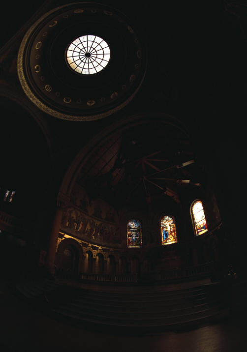
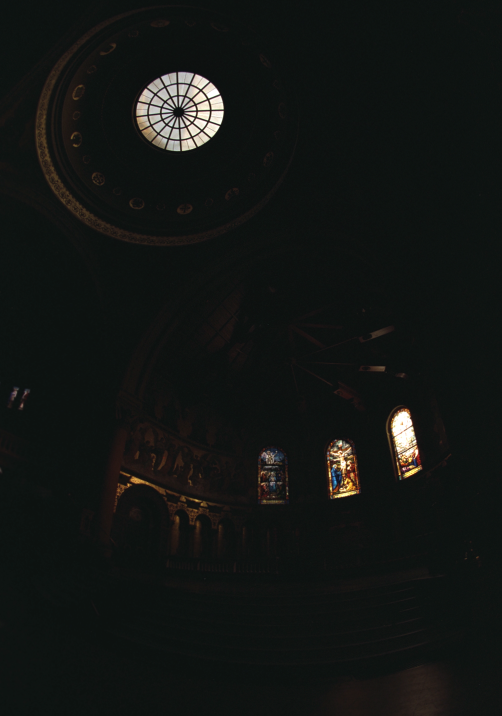
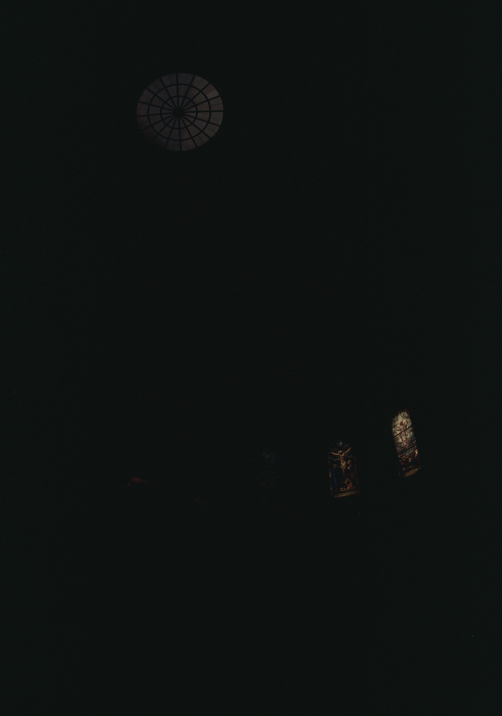

# CS 180 Final Project
Junye Wang 3040815937  Chuyan Zhou 3040814117

# Project 1: High Dynamic Range

    

        
        
        
        
        
        
        
        
    

    

        
        
        
        
        
        
        
        
    

## Background
Modern cameras are unable to capture the full dynamic range of commonly encountered real-world scenes. In some scenes, even the best possible photograph will be partially under or over-exposed. Researchers and photographers commonly get around this limitation by combining information from multiple exposures of the same scene. You will write software to automatically combine multiple exposures into a single high dynamic range radiance map, and then convert this radiance map to an image suitable for display through tone mapping.

There are two major components to this project:
- Recovering a radiance map from a collection of images
- Converting this radiance map into a display image

## Part 1: Radiance map construction

### 1. Stage 1: Film Response Recovery (g solve)
- $$g(Z)$$: response curve to be recovered
- $$Z$$: pixel value (N_pixels x N_images)
- $$\lambda$$: smoothness parameter

$$g(Z_{ij}) = \ln E_i + \ln \Delta t_j$$

Our goal is to minimize the following quadratic ob-
jective function:

$$O = \sum_{i=1}^{N}\sum_{j=1}^{P} [g(Z_{ij}) - \ln E_i - \ln \Delta t_j]^2 + \lambda \sum_{z=Z_{\text{min}}+1}^{Z_{\text{max}}-1} [g''(z)]^2$$

Weighting function:
$$
w(z) =
\begin{cases}
z - Z_{\text{min}}, & \text{if } z \leq \frac{1}{2}(Z_{\text{min}} + Z_{\text{max}}) \\
Z_{\text{max}} - z, & \text{if } z > \frac{1}{2}(Z_{\text{min}} + Z_{\text{max}})
\end{cases}
$$

## Stage 2: Constructing the High Dynamic Range Radiance Map
Once the response curve $$g$$ is recovered, it can be used to quickly convert pixel values to relative radiance values.

$$
\ln E_i = g(Z_{ij}) - \ln \Delta t_j
$$

$$
\ln E_i = \frac{\sum_{j=1}^{P} w(Z_{ij})(g(Z_{ij}) - \ln \Delta t_j)}{\sum_{j=1}^{P} w(Z_{ij})}
$$

    

        
        
HDR Output

    

    

        
        
Radiance Map

    

## Part 2: Tone mapping

1. **Compute Intensity (I)**  
   Calculate the intensity by averaging the color channels:
   $$ I = \frac{R + G + B}{3} $$

2. **Compute Chrominance Channels**  
   Normalize the color channels with respect to the intensity:
   $$ R/I, G/I, B/I $$

3. **Log Intensity Calculation**  
   Transform the intensity into the logarithmic domain:
   $$ L = \log_2(I) $$

4. **Bilateral Filtering**  
   Apply a bilateral filter to smooth the log intensity while preserving edges:
   $$ B = bf(L) $$

5. **Detail Layer Extraction**  
   Subtract the filtered base from the log intensity to isolate details:
   $$ D = L - B $$

6. **Base Adjustment**  
   Adjust the base layer with an offset and scale:
   $$ B' = (B - o) * s $$
   
   Where:
   - The offset `o` is set such that the maximum intensity of the base is 1, since the values are in the log domain:
     $$ o = max(B) $$
   - The scale `s` is determined to cover a dynamic range of `dR` stops:
     $$ s = \frac{dR}{max(B) - min(B)} $$

7. **Reconstruct Log Intensity**  
   Combine the adjusted base and detail layers:
   $$ O = 2^{(B' + D)} $$

8. **Color Reintegration**  
   Restore the colors using the chrominance channels:
   $$ R',G',B' = O * (R/I, G/I, B/I) $$

9. **Gamma Compression**  
   Apply gamma correction to prevent the image from appearing too dark:
   $$ result = (R',G',B')^{\gamma} $$

    <!-- Headers -->
    
Global Scale

    
Global Simple

    
Durand

    
Radiance Map

    <!-- Images for each scene -->
    <!-- arch scene -->
    
    
    
    
    <!-- bonsai scene -->
    
    
    
    
    <!-- chapel scene -->
    
    
    
    
    <!-- garage scene -->
    
    
    
    
    <!-- garden scene -->
    
    
    
    
    <!-- house scene -->
    
    
    
    
    <!-- mug scene -->
    
    
    
    
    <!-- window scene -->
    
    
    
    

## Part 3: Bells & Whistles

### 1. Try the algorithm on my own photos!

    <!-- Headers -->
    
Global Scale

    
Global Simple

    
Durand

    
Radiance Map

    
    
    
    

### 2. Fast Bilateral Filter

    

        
        
Bilateral Filter

    

    

        
        
Fast Bilateral Filter

    

- The results from standard bilateral filtering and fast bilateral filtering are nearly identical. 
- However, the performance difference is substantial - the fast bilateral filter processes each sample image in less than a second, while the standard bilateral filter takes approximately 5 minutes. This demonstrates a significant improvement in computational efficiency.

---

# Project 2: Image Quilting

## Overview
The goal of this assignment is to implement the image quilting algorithm for texture synthesis and transfer, described in this SIGGRAPH 2001 paper by Efros and Freeman. Texture synthesis is the creation of a larger texture image from a small sample. Texture transfer is giving an object the appearance of having the same texture as a sample while preserving its basic shape (see the face on toast image above). For texture synthesis, the main idea is to sample patches and lay them down in overlapping patterns, such that the overlapping regions are similar. The overlapping regions may not match exactly, which will result in noticeable edges. To fix this, you will compute a path along pixels with similar intensities through the overlapping region and use it to select which overlapping patch from which to draw each pixel. Texture transfer is achieved by encouraging sampled patches to have similar appearance to a given target image, as well as matching overlapping regions of already sampled patches. In this project, you will apply important techniques such as template matching, finding seams, and masking. These techniques are also useful for image stitching, image completion, image retargeting, and blending.

  
  
  
  
  

## Part 1: Randomly Sampled Texture
Create a function `quilt_random(sample, out_size, patch_size)` that randomly samples square patches of size patch_size from a sample in order to create an output image of size out_size. Start from the upper-left corner, and tile samples until the image are full. If the patches don't fit evenly into the output image, you can leave black borders at the edges. This is the simplest but least effective method. Save a result from a sample image to compare to the next two methods.

  
  
  
  
  

## Part 2: Overlapping Patches
Create a function `quilt_simple(sample, out_size, patch_size, overlap, tol)` that randomly samples square patches of size `patch_size` from a sample in order to create an output image of size `out_size`. Start by sampling a random patch for the upper-left corner. Then sample new patches to overlap with existing ones. For example, the second patch along the top row will overlap by `patch_size` pixels in the vertical direction and overlap pixels in the horizontal direction. Patches in the first column will overlap by `patch_size` pixels in the horizontal direction and `overlap` pixels in the vertical direction. Other patches will have two overlapping regions (on the top and left) which should both be taken into account. Once the cost of each patch has been computed, randomly choose on patch whose cost is less than a threshold determined by `tol` (see description of `choose_sample` below).

I suggest that you create two helper functions `ssd_patch` and `choose_sample`. `ssd_patch` performs template matching with the overlapping region, computing the cost of sampling each patch, based on the sum of squared differences (SSD) of the overlapping regions of the existing and sampled patch. I suggest using a masked template. The template is the patch in the current output image that is to be filled in (many pixel values will be 0 because they are not filled in yet). The mask has the same size as the patch template and has values of 1 in the overlapping region and values of 0 elsewhere. The SSD of the masked template with the input texture image can be computed efficiently using filtering operations. Suppose I have a template T, a mask M, and an image I: then, `ssd_cost = ((M*T)**2).sum() - 2 * cv2.filter2D(I, ddepth=-1, kernel = M*T) + cv2.filter2D(I ** 2, ddepth=-1, kernel=M)`. You can compute SSD in this way for each channel and sum the costs over channels. Each pixel of the `ssd_cost` gives you the cost for sampling a patch centered around that pixel.

`choose_sample` should take as input a cost image (each pixel's value is the cost of selecting the patch centered at that pixel) and select a randomly sampled patch with low cost. It's recommended to sort the costs and choose of of the tol smallest costs. So if `tol=1`, the lowest cost will always be chosen (this is a good way to debug but mainly copies the input texture). If `tol=3`, one of the three lowest cost patches will be chosen.

After a patch is sampled, its pixels should be copied directly into the corresponding position in the output image. Note that it is very easy to make alignment mistakes when computing the cost of each patch, sampling a low-cost patch, and copying the patch from the source to the output. Use an odd value for `patch_size` so that its center is well-defined. Be sure to thoroughly debug, for example, by checking that the overlapping portion of the copied pixels has the same SSD as the originally computed cost. As a sanity check, try generating a small texture image with `tol=1`, with the first patch sampled from the upper-left of the source image. This should produce a partial copy of the source image. Once you have this function working, save a result (with higher tolerance for more stochastic texture) generated from the same sample as used for the random method.

  
  
  
  
  

## Part 3: Seam Finding
Next, incorporate seam finding to remove edge artifacts from the overlapping patches (section 2.1 of the paper):

1. Use the cut function in utils.py (download `starter_codes` at the top) that finds the min-cost contiguous path from the left to right side of the patch according to the cost indicated by `bndcost`. The cost of a path through each pixel is the square differences (summed over RGB for color images) of the output image and the newly sampled patch. Note that if a patch has top and left overlaps, you will need to compute two seams and the mask can be defined as the intersection of the masks for each seam (`np.logical_and(mask1,mask2)`). To find a vertical path, you can apply cut to the transposed patch, e.g., `cut(bndcost.T).T`.
 
2. Create a function `quilt_cut` that incorporates the seam finding and use it to create a result to compare to the previous two methods.

  
  
  
  
  

## Part 4: Texture Transfer
Your final task is to create a function `texture_transfer`, based on your `quilt_cut` function for creating a texture sample that is guided by a pair of sample/target correspondence images (section 3 of the paper). You do not need to implement the iterative method described in the paper (you can do so for extra points: see Bells and Whistles). The main difference between this function and `quilt_cut` is that there is an additional cost term based on the difference between the sampled source patch and the target patch at the location to be filled.

  

## Bells & Whistles (face-in-toast)
Use a combination of texture transfer and Laplacian pyramid blending to create a face-in-toast image.
Using texture transfer, we got the "toast man":

  

Then we construct mask stack:

  

Finally, we got this:

  

