<script type="text/javascript" async
  src="https://cdnjs.cloudflare.com/ajax/libs/mathjax/2.7.7/MathJax.js?config=TeX-MML-AM_CHTML">
</script>

<style>
  body {
    background-color: #FFFAF0;
  }
  .image-container {
    padding: 10px;
    border-radius: 5px;
  }
  img {
    display: block;
    margin-left: auto;
    margin-right: auto;
  }
</style>

# CS 180 Final Project
Junye Wang 3040815937  Chuyan Zhou 3040814117

# Project 1: High Dynamic Range
<div style="display: flex; flex-direction: column; gap: 5px;">
    <div style="display: flex; gap: 5px; justify-content: center;">
        
        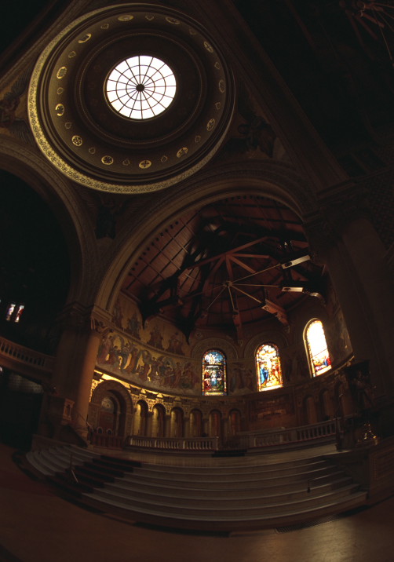
        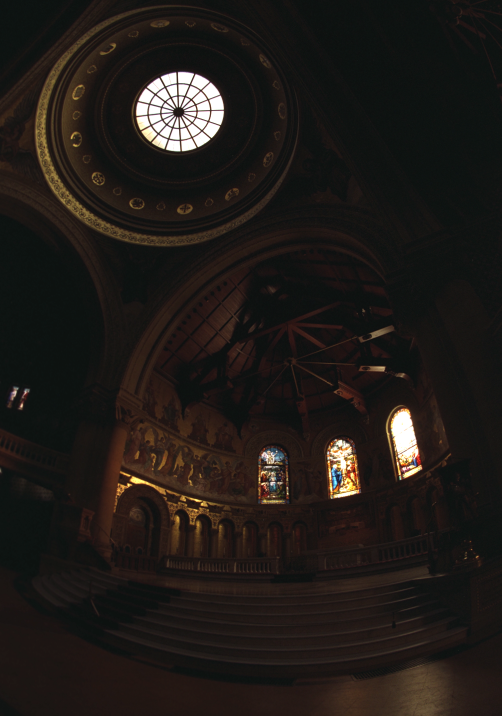
        
        
        
        
        
    </div>
    <div style="display: flex; gap: 5px; justify-content: center;">
        
        
        
        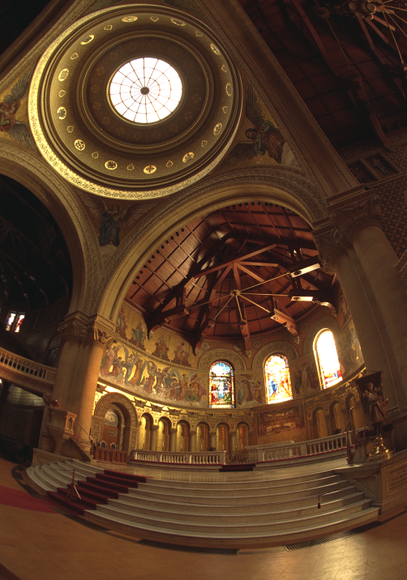
        
        
        
        
    </div>
</div>

## Background
Modern cameras are unable to capture the full dynamic range of commonly encountered real-world scenes. In some scenes, even the best possible photograph will be partially under or over-exposed. Researchers and photographers commonly get around this limitation by combining information from multiple exposures of the same scene. You will write software to automatically combine multiple exposures into a single high dynamic range radiance map, and then convert this radiance map to an image suitable for display through tone mapping.

There are two major components to this project:
- Recovering a radiance map from a collection of images
- Converting this radiance map into a display image

## Part 1: Radiance map construction

### 1. Stage 1: Film Response Recovery (g solve)
- $$g(Z)$$: response curve to be recovered
- $$Z$$: pixel value (N_pixels x N_images)
- $$\lambda$$: smoothness parameter

$$g(Z_{ij}) = \ln E_i + \ln \Delta t_j$$

Our goal is to minimize the following quadratic ob-
jective function:

$$O = \sum_{i=1}^{N}\sum_{j=1}^{P} [g(Z_{ij}) - \ln E_i - \ln \Delta t_j]^2 + \lambda \sum_{z=Z_{\text{min}}+1}^{Z_{\text{max}}-1} [g''(z)]^2$$

Weighting function:
$$
w(z) =
\begin{cases}
z - Z_{\text{min}}, & \text{if } z \leq \frac{1}{2}(Z_{\text{min}} + Z_{\text{max}}) \\
Z_{\text{max}} - z, & \text{if } z > \frac{1}{2}(Z_{\text{min}} + Z_{\text{max}})
\end{cases}
$$


## Stage 2: Constructing the High Dynamic Range Radiance Map
Once the response curve $$g$$ is recovered, it can be used to quickly convert pixel values to relative radiance values.

$$
\ln E_i = g(Z_{ij}) - \ln \Delta t_j
$$

$$
\ln E_i = \frac{\sum_{j=1}^{P} w(Z_{ij})(g(Z_{ij}) - \ln \Delta t_j)}{\sum_{j=1}^{P} w(Z_{ij})}
$$

<div style="display: flex; justify-content: space-around; margin: 20px 0;">
    <div style="display: flex; flex-direction: column; align-items: center; width: 45%;">
        
        <p style="text-align: center; font-style: italic;">HDR Output</p>
    </div>
    <div style="display: flex; flex-direction: column; align-items: center; width: 45%;">
        
        <p style="text-align: center; font-style: italic;">Radiance Map</p>
    </div>
</div>


## Part 2: Tone mapping

1. **Compute Intensity (I)**  
   Calculate the intensity by averaging the color channels:
   $$ I = \frac{R + G + B}{3} $$

2. **Compute Chrominance Channels**  
   Normalize the color channels with respect to the intensity:
   $$ R/I, G/I, B/I $$

3. **Log Intensity Calculation**  
   Transform the intensity into the logarithmic domain:
   $$ L = \log_2(I) $$

4. **Bilateral Filtering**  
   Apply a bilateral filter to smooth the log intensity while preserving edges:
   $$ B = bf(L) $$

5. **Detail Layer Extraction**  
   Subtract the filtered base from the log intensity to isolate details:
   $$ D = L - B $$

6. **Base Adjustment**  
   Adjust the base layer with an offset and scale:
   $$ B' = (B - o) * s $$
   
   Where:
   - The offset `o` is set such that the maximum intensity of the base is 1, since the values are in the log domain:
     $$ o = max(B) $$
   - The scale `s` is determined to cover a dynamic range of `dR` stops:
     $$ s = \frac{dR}{max(B) - min(B)} $$

7. **Reconstruct Log Intensity**  
   Combine the adjusted base and detail layers:
   $$ O = 2^{(B' + D)} $$

8. **Color Reintegration**  
   Restore the colors using the chrominance channels:
   $$ R',G',B' = O * (R/I, G/I, B/I) $$

9. **Gamma Compression**  
   Apply gamma correction to prevent the image from appearing too dark:
   $$ result = (R',G',B')^{\gamma} $$

<div style="display: grid; grid-template-columns: repeat(4, 1fr); gap: 10px; margin: 20px 0;">
    <!-- Headers -->
    <div style="font-weight: bold; text-align: center; padding: 5px;">Global Scale</div>
    <div style="font-weight: bold; text-align: center; padding: 5px;">Global Simple</div>
    <div style="font-weight: bold; text-align: center; padding: 5px;">Durand</div>
    <div style="font-weight: bold; text-align: center; padding: 5px;">Radiance Map</div>
    <!-- Images for each scene -->
    <!-- arch scene -->
    
    
    
    
    <!-- bonsai scene -->
    
    
    
    
    <!-- chapel scene -->
    
    
    
    
    <!-- garage scene -->
    
    
    
    
    <!-- garden scene -->
    
    
    
    
    <!-- house scene -->
    
    
    
    
    <!-- mug scene -->
    
    
    
    
    <!-- window scene -->
    
    
    
    
</div>

## Part 3: Bells & Whistles

### 1. Try the algorithm on my own photos!

<div style="display: grid; grid-template-columns: repeat(4, 1fr); gap: 10px; margin: 20px 0;">
    <!-- Headers -->
    <div style="font-weight: bold; text-align: center; padding: 5px;">Global Scale</div>
    <div style="font-weight: bold; text-align: center; padding: 5px;">Global Simple</div>
    <div style="font-weight: bold; text-align: center; padding: 5px;">Durand</div>
    <div style="font-weight: bold; text-align: center; padding: 5px;">Radiance Map</div>
    
    
    
    
</div>

### 2. Fast Bilateral Filter

<div style="display: flex; justify-content: space-around; margin: 20px 0;">
    <div style="display: flex; flex-direction: column; align-items: center; width: 45%;">
        
        <p style="text-align: center; font-style: italic;">Bilateral Filter</p>
    </div>
    <div style="display: flex; flex-direction: column; align-items: center; width: 45%;">
        
        <p style="text-align: center; font-style: italic;">Fast Bilateral Filter</p>
    </div>
</div>

- The results from standard bilateral filtering and fast bilateral filtering are nearly identical. 
- However, the performance difference is substantial - the fast bilateral filter processes each sample image in less than a second, while the standard bilateral filter takes approximately 5 minutes. This demonstrates a significant improvement in computational efficiency.


---

# Project 2: Image Quilting

## Overview
The goal of this assignment is to implement the image quilting algorithm for texture synthesis and transfer, described in this SIGGRAPH 2001 paper by Efros and Freeman. Texture synthesis is the creation of a larger texture image from a small sample. Texture transfer is giving an object the appearance of having the same texture as a sample while preserving its basic shape (see the face on toast image above). For texture synthesis, the main idea is to sample patches and lay them down in overlapping patterns, such that the overlapping regions are similar. The overlapping regions may not match exactly, which will result in noticeable edges. To fix this, you will compute a path along pixels with similar intensities through the overlapping region and use it to select which overlapping patch from which to draw each pixel. Texture transfer is achieved by encouraging sampled patches to have similar appearance to a given target image, as well as matching overlapping regions of already sampled patches. In this project, you will apply important techniques such as template matching, finding seams, and masking. These techniques are also useful for image stitching, image completion, image retargeting, and blending.

<div style="display: flex; justify-content: space-between;">
  
  
  
  
  
</div>

## Part 1: Randomly Sampled Texture
Create a function `quilt_random(sample, out_size, patch_size)` that randomly samples square patches of size patch_size from a sample in order to create an output image of size out_size. Start from the upper-left corner, and tile samples until the image are full. If the patches don't fit evenly into the output image, you can leave black borders at the edges. This is the simplest but least effective method. Save a result from a sample image to compare to the next two methods.

<div style="display: flex; justify-content: space-between;">
  
  
  
  
  
</div>

## Part 2: Overlapping Patches
Create a function `quilt_simple(sample, out_size, patch_size, overlap, tol)` that randomly samples square patches of size `patch_size` from a sample in order to create an output image of size `out_size`. Start by sampling a random patch for the upper-left corner. Then sample new patches to overlap with existing ones. For example, the second patch along the top row will overlap by `patch_size` pixels in the vertical direction and overlap pixels in the horizontal direction. Patches in the first column will overlap by `patch_size` pixels in the horizontal direction and `overlap` pixels in the vertical direction. Other patches will have two overlapping regions (on the top and left) which should both be taken into account. Once the cost of each patch has been computed, randomly choose on patch whose cost is less than a threshold determined by `tol` (see description of `choose_sample` below).

I suggest that you create two helper functions `ssd_patch` and `choose_sample`. `ssd_patch` performs template matching with the overlapping region, computing the cost of sampling each patch, based on the sum of squared differences (SSD) of the overlapping regions of the existing and sampled patch. I suggest using a masked template. The template is the patch in the current output image that is to be filled in (many pixel values will be 0 because they are not filled in yet). The mask has the same size as the patch template and has values of 1 in the overlapping region and values of 0 elsewhere. The SSD of the masked template with the input texture image can be computed efficiently using filtering operations. Suppose I have a template T, a mask M, and an image I: then, `ssd_cost = ((M*T)**2).sum() - 2 * cv2.filter2D(I, ddepth=-1, kernel = M*T) + cv2.filter2D(I ** 2, ddepth=-1, kernel=M)`. You can compute SSD in this way for each channel and sum the costs over channels. Each pixel of the `ssd_cost` gives you the cost for sampling a patch centered around that pixel.

`choose_sample` should take as input a cost image (each pixel's value is the cost of selecting the patch centered at that pixel) and select a randomly sampled patch with low cost. It's recommended to sort the costs and choose of of the tol smallest costs. So if `tol=1`, the lowest cost will always be chosen (this is a good way to debug but mainly copies the input texture). If `tol=3`, one of the three lowest cost patches will be chosen.

After a patch is sampled, its pixels should be copied directly into the corresponding position in the output image. Note that it is very easy to make alignment mistakes when computing the cost of each patch, sampling a low-cost patch, and copying the patch from the source to the output. Use an odd value for `patch_size` so that its center is well-defined. Be sure to thoroughly debug, for example, by checking that the overlapping portion of the copied pixels has the same SSD as the originally computed cost. As a sanity check, try generating a small texture image with `tol=1`, with the first patch sampled from the upper-left of the source image. This should produce a partial copy of the source image. Once you have this function working, save a result (with higher tolerance for more stochastic texture) generated from the same sample as used for the random method.

<div style="display: flex; justify-content: space-between;">
  
  
  
  
  
</div>

## Part 3: Seam Finding
Next, incorporate seam finding to remove edge artifacts from the overlapping patches (section 2.1 of the paper):

1. Use the cut function in utils.py (download `starter_codes` at the top) that finds the min-cost contiguous path from the left to right side of the patch according to the cost indicated by `bndcost`. The cost of a path through each pixel is the square differences (summed over RGB for color images) of the output image and the newly sampled patch. Note that if a patch has top and left overlaps, you will need to compute two seams and the mask can be defined as the intersection of the masks for each seam (`np.logical_and(mask1,mask2)`). To find a vertical path, you can apply cut to the transposed patch, e.g., `cut(bndcost.T).T`.
 
2. Create a function `quilt_cut` that incorporates the seam finding and use it to create a result to compare to the previous two methods.

<div style="display: flex; justify-content: space-between;">
  
  
  
  
  
</div>

## Part 4: Texture Transfer
Your final task is to create a function `texture_transfer`, based on your `quilt_cut` function for creating a texture sample that is guided by a pair of sample/target correspondence images (section 3 of the paper). You do not need to implement the iterative method described in the paper (you can do so for extra points: see Bells and Whistles). The main difference between this function and `quilt_cut` is that there is an additional cost term based on the difference between the sampled source patch and the target patch at the location to be filled.

<div style="display: flex; justify-content: space-between;">
  
</div>

## Bells & Whistles (face-in-toast)
Use a combination of texture transfer and Laplacian pyramid blending to create a face-in-toast image.
Using texture transfer, we got the "toast man":

<div style="display: flex; justify-content: space-between;">
  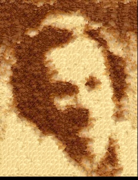
</div>

Then we construct mask stack:

<div style="display: flex; justify-content: space-between;">
  
</div>

Finally, we got this:

<div style="display: flex; justify-content: space-between;">
  
</div>

---

# Project 3: Facial Keypoint Detection with Neural Networks

## Part 1: Nose Tip Detection

For the first part, we use the IMM Face Database for training an initial toy model for nose tip detection. The dataset has 240 facial images of 40 persons and each person has 6 facial images in different viewpoints. All images are annotated with 58 facial keypoints. We use all 6 images of the first 32 persons (index 1-32) as the training set (total 32 x 6 = 192 images) and the images of the remaining 8 persons (index 33-40) (8 * 6 = 48 images) as the validation set.

For data parsing (parsing ASF files), I inherited my implementation from Project 3.

The 52-th point of each face is considered the nose tip, but it's actually the top of the philtrum. I implement a method for finding the weighted average of nearby points where the weights are decided by the direction the faces in the dataset are facing, which is more like the real keypoints of nose tips. However, because this is not explicitly allowed, I just use 52-th points for the following detection task.

For data preprocessing, for every part not only part 1, I rescale the keypoints to [0,1] relative space, and convert the images to grayscale, as well as `im/255. - 0.5` for normalizing.

And for part 1 and 2, I resize the image by 

Here are some images sampled from the dataloader with groundtruth keypoints:

<div style="display: flex; justify-content: space-around;">
  <figure style="text-align: center; margin: 10px;">
    
    <figcaption>Samples from dataloader</figcaption>
  </figure>
</div> 

This is the detailed CNN model architecture, summarized by `torchsummary`:

```
----------------------------------------------------------------
        Layer (type)               Output Shape         Param #
================================================================
            Conv2d-1           [-1, 12, 74, 54]             600
              ReLU-2           [-1, 12, 74, 54]               0
         MaxPool2d-3           [-1, 12, 37, 27]               0
            Conv2d-4           [-1, 24, 33, 23]           7,224
              ReLU-5           [-1, 24, 33, 23]               0
         MaxPool2d-6           [-1, 24, 16, 11]               0
            Conv2d-7            [-1, 32, 14, 9]           6,944
              ReLU-8            [-1, 32, 14, 9]               0
         MaxPool2d-9             [-1, 32, 7, 4]               0
          Flatten-10                  [-1, 896]               0
           Linear-11                  [-1, 128]         114,816
             ReLU-12                  [-1, 128]               0
           Linear-13                    [-1, 2]             258
================================================================
Total params: 129,842
Trainable params: 129,842
Non-trainable params: 0
----------------------------------------------------------------
Input size (MB): 0.02
Forward/backward pass size (MB): 1.21
Params size (MB): 0.50
Estimated Total Size (MB): 1.72
----------------------------------------------------------------
```

It can also be interpreted as:

+ Input image: (1, 80, 60);
+ 1st Convolution Layer: 12 output channels, stride 1, no padding, kernel size 7x7, followed by a ReLU and a MaxPool2d of kernel size 2;
+ 2nd Convolution Layer: 24 output channels, stride 1, no padding, kernel size 5x5, followed by a ReLU and a MaxPool2d of kernel size 2;
+ 3rd Convolution Layer: 32 output channels, stride 1, no padding, kernel size 3x3, followed by a ReLU and a MaxPool2d of kernel size 2;
+ A flatten layer, a linear layer to 128 dimensions, a ReLU layer and finally a linear layer to 2 dimensions (2,) which completes a regression task.

I use an Adam optimizer with a learning rate of 1e-3 and MSE as my loss. I try 4 different sets of {LR, Architectures} and find the hyperparameter set of above architecture and LR=1e-3 will bring the best validation loss. Also, the model is trained with 25 epochs.

+ LR: 1e-3 or 5e-3
+ Architecture (List of output channels): [12,24,32] or [24,28,32]

<div style="display: flex; justify-content: space-around;">
  <figure style="text-align: center; margin: 10px;">
    
  </figure>
  <figure style="text-align: center; margin: 10px;">
    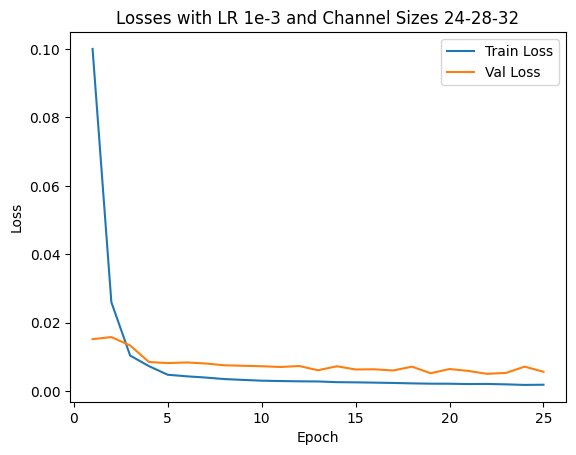
  </figure>
</div> 

<div style="display: flex; justify-content: space-around;">
  <figure style="text-align: center; margin: 10px;">
    
  </figure>
  <figure style="text-align: center; margin: 10px;">
    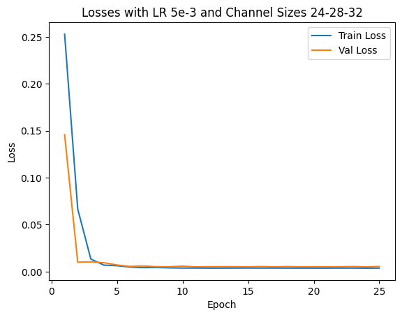
  </figure>
</div> 

We show 2 correct detection and 2 failed detection:

<div style="display: flex; justify-content: space-around;">
  <figure style="text-align: center; margin: 10px;">
    
    <figcaption>Correct Sample 1</figcaption>
  </figure>
  <figure style="text-align: center; margin: 10px;">
    
    <figcaption>Correct Sample 2</figcaption>
  </figure>
</div> 

<div style="display: flex; justify-content: space-around;">
  <figure style="text-align: center; margin: 10px;">
    
    <figcaption>Incorrect Sample 1</figcaption>
  </figure>
  <figure style="text-align: center; margin: 10px;">
    
    <figcaption>Incorrect Sample 2</figcaption>
  </figure>
</div> 

## Part 2: Full Facial Keypoints Detection

In this section we want to move forward and detect all 58 facial keypoints/landmarks.

Because the task is harder, to prevent overfitting, I implement data augmentations:

1. Random affine transformation with 10% x/y translation (by 0.5 chance), and with rotation of 15 degrees;
2. Random color jitter with brightness 0.1, hue 0.1, saturation 0.1, contrast 0.1;

Here it's wrong to directly use horizontal flips in the augmentation because if so, the left eye may be flipped to the right of the image, and the model could only learn a mean value i.e. the keypoints are basically concentrated on the middle line, unless we exchange labels by hand.

The samples from the (augmented) dataloader is shown as follows:

<div style="display: flex; justify-content: space-around;">
  <figure style="text-align: center; margin: 10px;">
    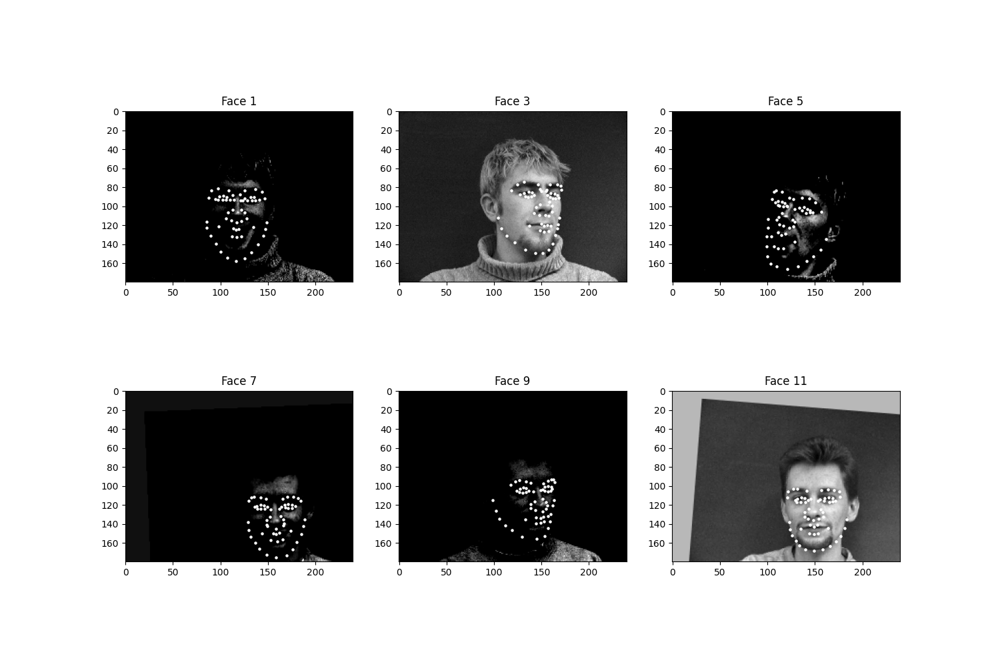
    <figcaption>Samples from dataloader</figcaption>
  </figure>
</div> 

This is the detailed model architecture, summarized by `torchsummary`: (I have also implemented `torchsummary` summaries for part 3 & 4, but the summary will last too long to be exhibited)

```
----------------------------------------------------------------
        Layer (type)               Output Shape         Param #
================================================================
            Conv2d-1         [-1, 32, 180, 240]             320
              ReLU-2         [-1, 32, 180, 240]               0
         MaxPool2d-3          [-1, 32, 90, 120]               0
            Conv2d-4          [-1, 64, 90, 120]          18,496
              ReLU-5          [-1, 64, 90, 120]               0
         MaxPool2d-6           [-1, 64, 45, 60]               0
            Conv2d-7          [-1, 128, 45, 60]          73,856
              ReLU-8          [-1, 128, 45, 60]               0
         MaxPool2d-9          [-1, 128, 22, 30]               0
           Conv2d-10          [-1, 256, 22, 30]         295,168
             ReLU-11          [-1, 256, 22, 30]               0
        MaxPool2d-12          [-1, 256, 11, 15]               0
           Conv2d-13          [-1, 512, 11, 15]       1,180,160
             ReLU-14          [-1, 512, 11, 15]               0
        MaxPool2d-15            [-1, 512, 5, 7]               0
           Conv2d-16            [-1, 512, 5, 7]       2,359,808
             ReLU-17            [-1, 512, 5, 7]               0
        MaxPool2d-18            [-1, 512, 2, 3]               0
          Flatten-19                 [-1, 3072]               0
           Linear-20                 [-1, 2048]       6,293,504
             ReLU-21                 [-1, 2048]               0
           Linear-22                  [-1, 116]         237,684
================================================================
Total params: 10,458,996
Trainable params: 10,458,996
Non-trainable params: 0
----------------------------------------------------------------
Input size (MB): 0.16
Forward/backward pass size (MB): 46.19
Params size (MB): 39.90
Estimated Total Size (MB): 86.25
----------------------------------------------------------------
```

The architecture contains convolution layers of kernel size 3 with channel `1->32->64->128->256->512->512` followed by flattening, a ReLU activation layer and linear layers. We output a (68*2) coordinate group which is a regression task. We have an Adam optimizer with LR 1e-3 and train the model for 300 epochs. The losses are plotted as follows:

<div style="display: flex; justify-content: space-around;">
  <figure style="text-align: center; margin: 10px;">
    
    <figcaption></figcaption>
  </figure>
</div> 

The final validation MSE is 0.0016. We show some correct & incorrect detections, where we define correctly detect samples here by MSE < 5e-4:

<div style="display: flex; justify-content: space-around;">
  <figure style="text-align: center; margin: 10px;">
    
    <figcaption>Correct Sample 1</figcaption>
  </figure>
  <figure style="text-align: center; margin: 10px;">
    
    <figcaption>Correct Sample 2</figcaption>
  </figure>
</div> 

<div style="display: flex; justify-content: space-around;">
  <figure style="text-align: center; margin: 10px;">
    
    <figcaption>Incorrect Sample 1</figcaption>
  </figure>
  <figure style="text-align: center; margin: 10px;">
    
    <figcaption>Incorrect Sample 2</figcaption>
  </figure>
</div> 

Here are some visualized filters from the first layer (layer 0), where we can see roughly there are diagonal edge detectors and derivative filters for example.

<div style="display: flex; justify-content: space-around;">
  <figure style="text-align: center; margin: 10px;">
    
    <figcaption>Visualized filters from layer 0, channel 0</figcaption>
  </figure>
</div> 

## Part 3: Train With a Larger Dataset (Regression on iBUG dataset)

In this part and next part, we use ResNets to train on iBUG facial keypoints dataset, where each image contains 68 keypoints. We in this part still do regression tasks for predicting the coordinates.

Given the same data augmentations as part 2, we show some samples from the dataloader which resizes every input image (cropped by a corresponding bounding box) to (224, 224) in preprocessing.

<div style="display: flex; justify-content: space-around;">
  <figure style="text-align: center; margin: 10px;">
    
    <figcaption></figcaption>
  </figure>
  <figure style="text-align: center; margin: 10px;">
    
    <figcaption></figcaption>
  </figure>
  <figure style="text-align: center; margin: 10px;">
    
    <figcaption></figcaption>
  </figure>
  <figure style="text-align: center; margin: 10px;">
    
    <figcaption></figcaption>
  </figure>
</div> 

We can see that the keypoints are often out of the bounding box even though here is no augmentations applied, but for this part, we are doing regression, so it won't hurt much because the output space is $\R$.

We use a ResNet50 architecture and modify the first convolution layer to feed it (N, 1, 224, 224) image batches, also the final linear layer to let it output 136=68*2 real values which can be rearranged as (68, 2) keypoint coordinates.

We use an Adam optimizer with LR 5e-4. We train 20 epochs. The losses are:

<div style="display: flex; justify-content: space-around;">
  <figure style="text-align: center; margin: 10px;">
    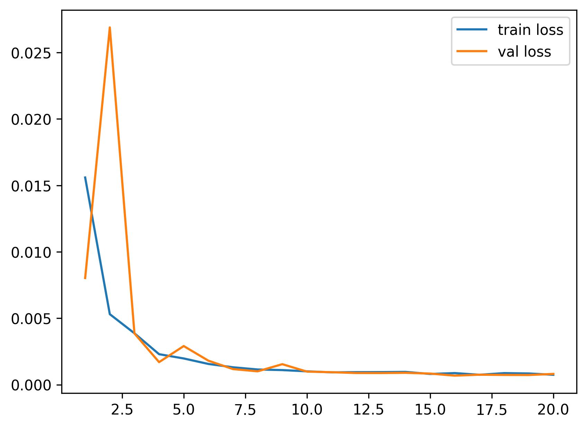
    <figcaption></figcaption>
  </figure>
</div> 

We test on 4 images in the test set:

<div style="display: flex; justify-content: space-around;">
  <figure style="text-align: center; margin: 10px;">
    
    <figcaption></figcaption>
  </figure>
</div> 

It succeeds on all images. The regression seems powerful as is shown above.

For 3 images from my own collection:

<div style="display: flex; justify-content: space-around;">
  <figure style="text-align: center; margin: 10px;">
    
    <figcaption>ZUN</figcaption>
  </figure>
</div> 

A tilted face direction may let the model be not so robust.

<div style="display: flex; justify-content: space-around;">
  <figure style="text-align: center; margin: 10px;">
    
    <figcaption>Cat</figcaption>
  </figure>
</div> 

The model also works on some cats.

<div style="display: flex; justify-content: space-around;">
  <figure style="text-align: center; margin: 10px;">
    
    <figcaption>Zizek</figcaption>
  </figure>
</div> 

This is a correct detection. The regression model will get a test MAE (on Kaggle) of 8.5 publicly and 8.46 privately.

## Part 4: Pixelwise Classification (on iBUG dataset)

In this part, we want to predict heatmaps for "how much probabilities one point would be a nose tip" or "how much probabilities one point would be a right eye", i.e. we are doing pixelwise classification, where the # of classes are 224*224, and every image has 68 subtasks of pixelwise classification like this.

For the dataset preprocessing, we put a Gaussian with a sigma of 0.05 in the scale of the [0,1]-normalized coordinates. Because the Gaussian is discretized and cropped from the infinite real space to the 224*224 coordinates, so we normalize every map and compose them into a (68, 224, 224) shape as the groundtruth, where every (224, 224) heatmap sum to 1.

We use the same data augmentation as above.

Here is a visualized heatmap for one keypoint:

<div style="display: flex; justify-content: space-around;">
  <figure style="text-align: center; margin: 10px;">
    
    <figcaption></figcaption>
  </figure>
</div> 

We can find the expected coordinates are not the same as the real labels, but the MAE between them is negligible compared to the scale of MAE of the model predictions.

Here are some visualization for accumulated heatmaps (sums of 68 heatmaps):

<div style="display: flex; justify-content: space-around;">
  <figure style="text-align: center; margin: 10px;">
    
    <figcaption></figcaption>
  </figure>
  <figure style="text-align: center; margin: 10px;">
    
    <figcaption></figcaption>
  </figure>
</div> 

My model architecture is a UNet inherited from the Unconditional UNet from Project 5B, which is basically this but the input is changed from (1, 28, 28) to (1, 224, 224), and the output is changed to (68, 224, 224). Also, we specify $D=128$ here.

<div style="display: flex; justify-content: space-around;">
  <figure style="text-align: center; margin: 10px;">
    
    <figcaption></figcaption>
  </figure>
</div> 

I optimize the MSE losses between the groundtruth discretized Gaussian heatmaps and the predicted heatmaps which is normalized from logits by softmax over a squeezed dimension of size 224*224. The MSE has a reduction method as summation instead of mean, otherwise the loss will be extremely small (to 1e-9 scale) and the model can hardly learn anything.

I use an Adam optimizer with LR 5e-3, a batch size of 32, and train 25 epochs.

From epoch 0 to 2, the outputted heatmaps are just doing copies of the input images and the (absolute coordinate) MAE plateaus at about 55, but one can see the phenomenon of emergence from epoch 3 as the model starts to destroy the input signal and think about the supervising signal i.e. the Gaussian groundtruth heatmaps. After it becomes aware of the heatmap formalism, it starts to move its predicted high-probability district from some irrelevant places towards the groundtruth label coordinates.

<div style="display: flex; justify-content: space-around;">
  <figure style="text-align: center; margin: 10px;">
    
    <figcaption>Epoch 0, Landmark 0</figcaption>
  </figure>
  <figure style="text-align: center; margin: 10px;">
    
    <figcaption>Epoch 0, predicted landmarks</figcaption>
  </figure>
</div> 

<div style="display: flex; justify-content: space-around;">
  <figure style="text-align: center; margin: 10px;">
    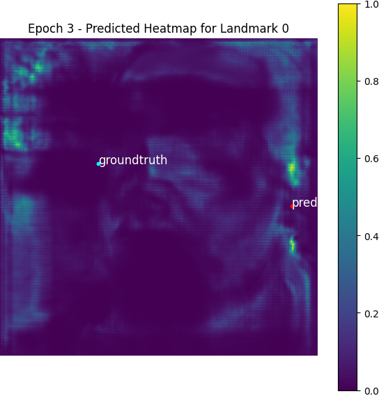
    <figcaption>Epoch 3, Landmark 0</figcaption>
  </figure>
  <figure style="text-align: center; margin: 10px;">
    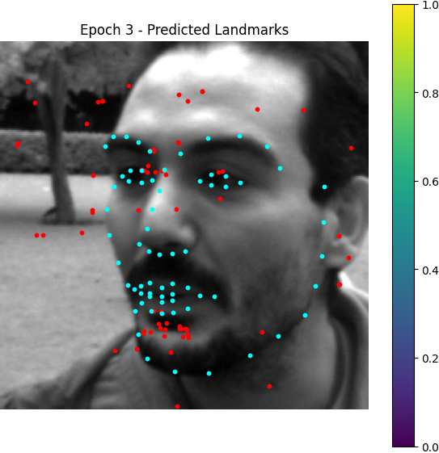
    <figcaption>Epoch 3, predicted landmarks</figcaption>
  </figure>
</div> 

<div style="display: flex; justify-content: space-around;">
  <figure style="text-align: center; margin: 10px;">
    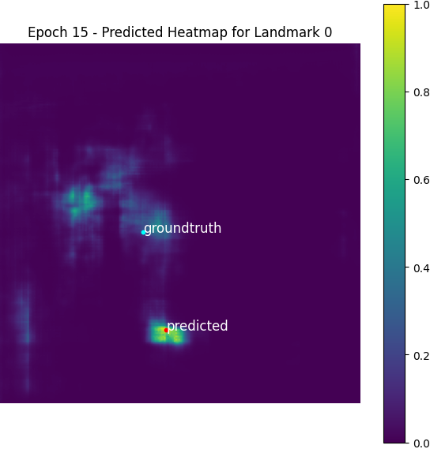
    <figcaption>Epoch 15, Landmark 0</figcaption>
  </figure>
  <figure style="text-align: center; margin: 10px;">
    
    <figcaption>Epoch 15, predicted landmarks</figcaption>
  </figure>
</div> 

<div style="display: flex; justify-content: space-around;">
  <figure style="text-align: center; margin: 10px;">
    
    <figcaption>Epoch 24, Landmark 0</figcaption>
  </figure>
  <figure style="text-align: center; margin: 10px;">
    
    <figcaption>Epoch 24, predicted landmarks</figcaption>
  </figure>
</div> 

Here is the losses plotted:

<div style="display: flex; justify-content: space-around;">
  <figure style="text-align: center; margin: 10px;">
    
    <figcaption></figcaption>
</div> 

Some test images:

<div style="display: flex; justify-content: space-around;">
  <figure style="text-align: center; margin: 10px;">
    
    <figcaption></figcaption>
</div> 

We can see the bottom left image is predicted so well, but the other 3 has some little flaws. Actually this setup will get a test score (on Kaggle) of about 9.39 publicly and 9.46 privately, which is not as good as the regression model. I think it's because the UNet may be too burdened to express when we want to extract 68 channels from one channel.

Testing on my collected images:

<div style="display: flex; justify-content: space-around;">
  <figure style="text-align: center; margin: 10px;">
    
    <figcaption>ZUN</figcaption>
  </figure>
</div> 

For this image, the model still fails, but we can see a rough form of face profiles.

<div style="display: flex; justify-content: space-around;">
  <figure style="text-align: center; margin: 10px;">
    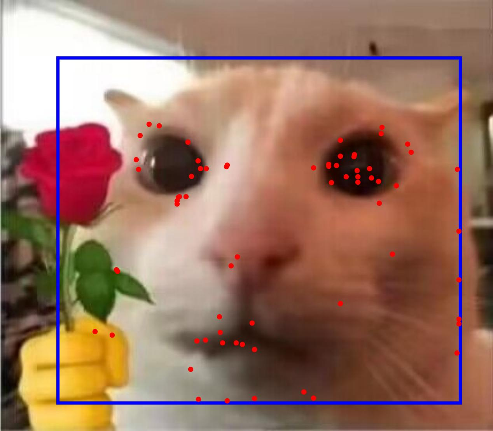
    <figcaption>Cat</figcaption>
  </figure>
</div> 

This time, the model does not generalize to cats.

<div style="display: flex; justify-content: space-around;">
  <figure style="text-align: center; margin: 10px;">
    
    <figcaption>Zizek</figcaption>
  </figure>
</div> 

I think this is a successful detection.