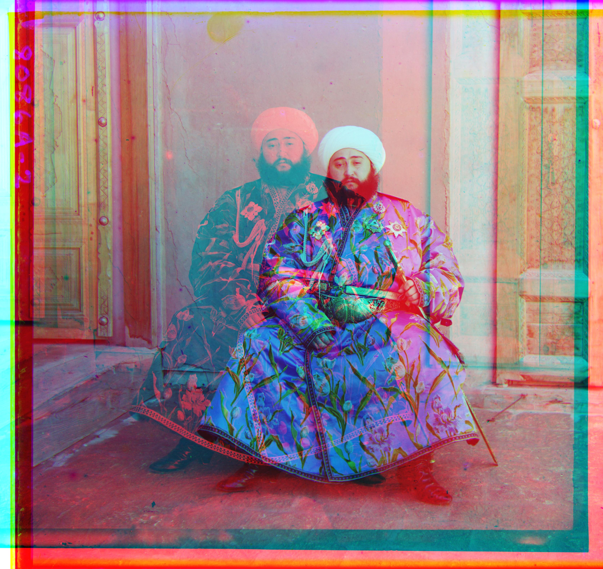

# Project1: Images of the Russian Empire

The goal of this assignment is to take the digitized Prokudin-Gorskii glass plate images and, using image processing techniques, automatically produce a color image with as few visual artifacts as possible.

### Preliminary Idea

All input images are simply divided into slices of 1/3 of the original height, and the L2 norm is used to evaluate the alignment performance. The red and green channels are aligned to the blue channel as the reference. However, the results of this direct alignment are surprisingly poor, as the slices obtained by equally dividing the image have significant black borders around them, which severely affects the alignment accuracy. 

The issues encountered include:  
- The black borders cause significant errors in the alignment algorithm calculations.  
- For high-resolution images, traditional alignment algorithms require a large amount of time.

### Step 1: Crop Before Alignment

To avoid interference from the original black borders on the alignment algorithm, I applied the same proportional cropping to all channels, using only the central portion of each channel for alignment while ignoring the rest. There are various options for this cropping ratio, but to avoid the black borders while retaining enough image information, I chose a 50% cropping rate (in fact, changing this ratio to other similar values will not affect the final alignment result).

After implementing the improvements, my algorithm achieved precise and fast alignment for small images:

    

        <h6>cathedral.jpg</h6>
        
        
G offset: (5, 2), R offset: (12, 3)

    

    

        <h6>monastery.jpg</h6>
        
        
G offset: (-3, 2), R offset: (3, 2)

    

    

        <h6>tobolsk.jpg</h6>
        
        
G offset: (3, 3), R offset: (7, 3)

    

### Step 2: Speed Up Using Image Pyramid

An **image pyramid** is a multi-scale representation of an image, often used in image processing tasks such as alignment, compression, and object detection. The idea is to create a series of progressively smaller images, each formed by downscaling the original image. These smaller images are stacked like a pyramid, with the original image at the base and the smallest image at the top.

There are two main types of image pyramids:

1. **Gaussian Pyramid**: Each layer is created by applying a Gaussian blur to the previous layer and then downsampling it. This type of pyramid is often used in coarse-to-fine image alignment or when reducing image detail at different scales.

2. **Laplacian Pyramid**: This pyramid is formed by subtracting each Gaussian layer from the layer above it, effectively capturing the difference in image detail between scales. Laplacian pyramids are useful for image compression and blending, as they represent image details in a more compact form.

Image pyramids allow for faster processing by enabling algorithms to operate on smaller, less detailed versions of the image before refining results on higher-resolution layers. This technique is particularly effective in tasks that require multi-scale analysis or iterative refinement, such as object tracking, image stitching, and alignment.

For small images, the current algorithm has achieved ideal results. However, for high-resolution images, the algorithm takes a considerable amount of time due to exhaustive search. Based on suggestions, I adopted the image pyramid technique to improve the alignment process for high-resolution images. The detailed steps are as follows:

1. **Selecting the upper limit for the highest pyramid layer size**: As the pyramid layers increase, the higher-level images become progressively smaller. However, overly small images lack sufficient information, so I limited the pyramid to a maximum of 4 layers, with the highest layer being 1/8 the size of the original image and the lowest layer being the original size.
2. **Aligning layer by layer from the highest pyramid layer**: Alignment begins at the highest layer, and for each subsequent layer, the displacement found from the previous layer is doubled as the starting point for alignment.
3. **Applying the final displacement obtained from the pyramid**: The final displacement from the pyramid alignment is applied to the cropped channels of the original image to produce the aligned color image.

Using these techniques, the algorithm now only takes 2 to 3 seconds to align a 3k-4k resolution image.

    

        <h6>train.tif</h6>
        
        
G offset: (42, 6), R offset: (86, 32)

    

    

        <h6>church.tif</h6>
        
        
G offset: (24, 4), R offset: (58, -4)

    

    

        <h6>aligned_harvesters.tif</h6>
        
        
G offset: (58, 16), R offset: (124, 14)

    

    

        <h6>icon.tif</h6>
        
        
G offset: (40, 18), R offset: (90, 22)

    

    

        <h6>melons.tif</h6>
        
        
G offset: (82, 10), R offset: (178, 14)

    

    

        <h6>onion_church.tif</h6>
        
        
G offset: (52, 26), R offset: (108, 36)

    

    

        <h6>sculpture.tif</h6>
        
        
G offset: (34, -10), R offset: (140, -26)

    

    

        <h6>self_portrait.tif</h6>
        
        
G offset: (78, 28), R offset: (176, 36)

    

    

        <h6>three_generations.tif</h6>
        
        
G offset: (50, 14), R offset: (110, 12)

    

    

        <h6>lady.tif</h6>
        
        
G offset: (50, 8), R offset: (108, 12)

    

    

        <h6>emir.tif</h6>
        
        
G offset: (48, 24), R offset: (0, -332)

    

### Step 3: Addressing the issue of brightness differences in the channels of emir.tif.
Through the optimizations in Step 2, I have established a fast image alignment algorithm, but the alignment effect for emir.tif turned out to be surprisingly poor, with the offset of the red channel clearly miscalculated. 

Upon reviewing the original channels, I found that the three original channels exhibited completely different brightness levels, and the existing SSD-based alignment method could not handle such images. Therefore, I applied **histogram equalization** to balance the brightness of the three channels, and then used the **structural similarity (SSIM)** method for alignment.

**Brightness Equalization of Three Channels:**

**The final result:** g_offset: (48, 22), r_offset: (102, 40)

