# CS 180 Project 2: Fun with Filters and Frequencies

## Part 1: Fun with Filters
In this part, we will build intuitions about 2D convolutions and filtering.

### Part 1.1: Finite Difference Operator

We will begin by using the humble finite difference as our filter in the x and y directions.
$$
D_x = \begin{bmatrix}
1 & -1
\end{bmatrix},\ \ 
D_y = \begin{bmatrix}
1 \\
-1
\end{bmatrix}
$$
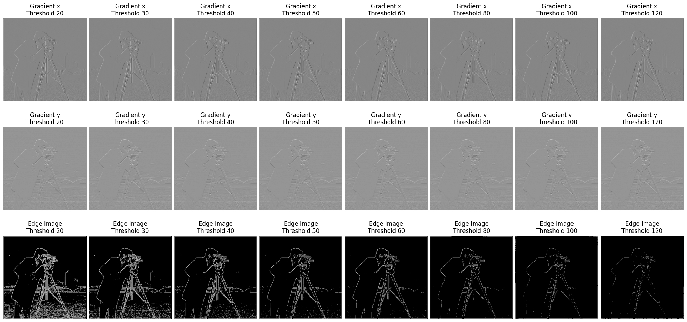

### Part 1.2: Derivative of Gaussian (DoG) Filter
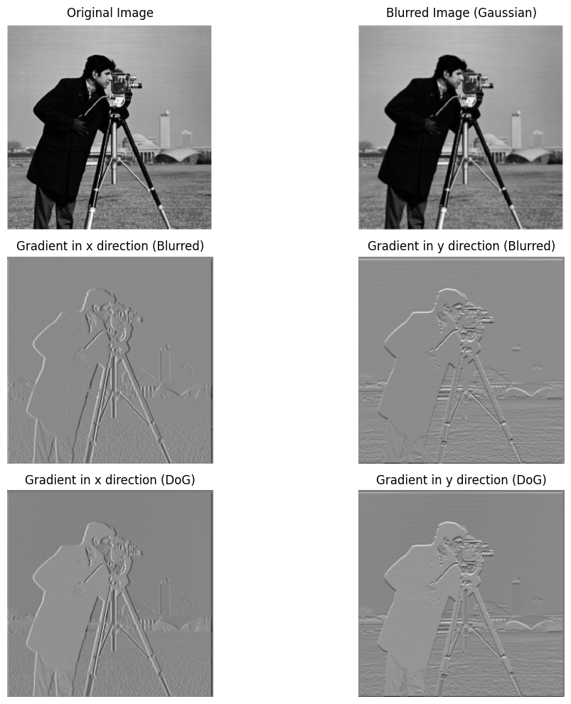

## Part 2: Fun with Frequencies!

### Part 2.1: Image "Sharpening"
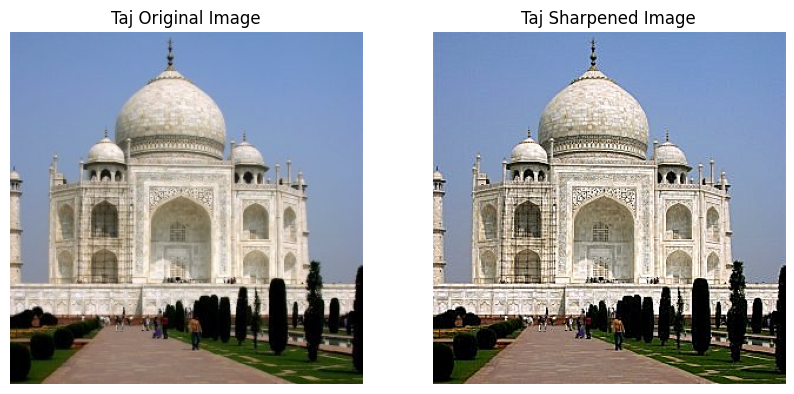

    

        
        
GTA5

    

    

        
        
GTA5_blurred

    

    

        
        
GTA5_sharpened

    

    

        
        
GreatWall

    

    

        
        
GreatWall_sharpened

    

    

        
        
Sea

    

    

        
        
Sea_sharpened

    

### Part 2.2: Hybrid Images
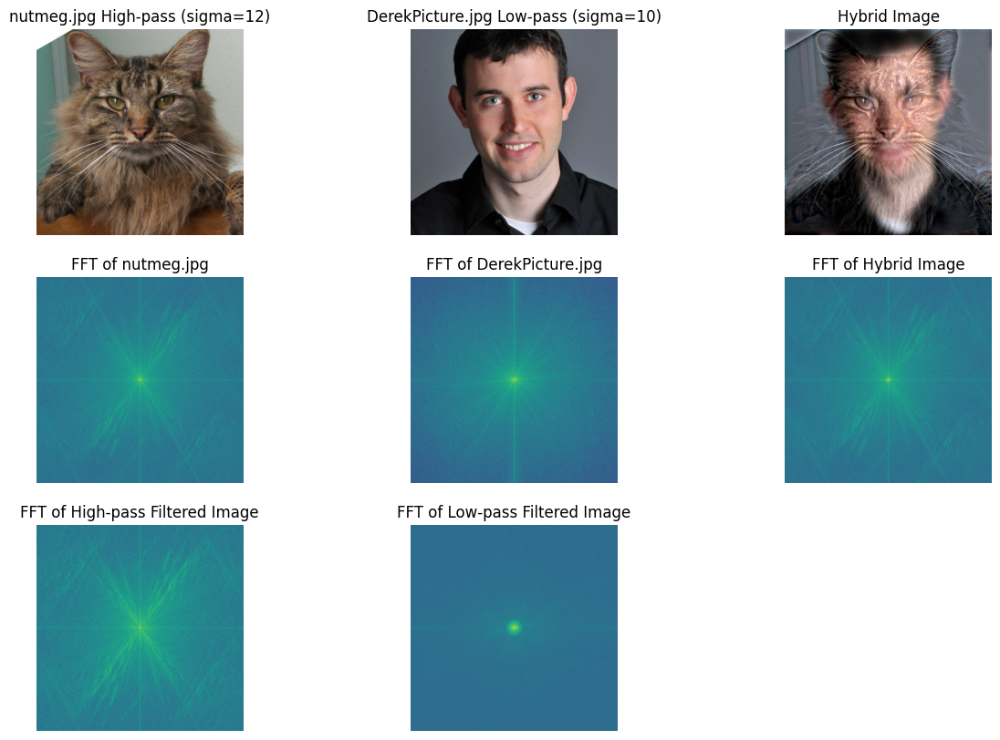

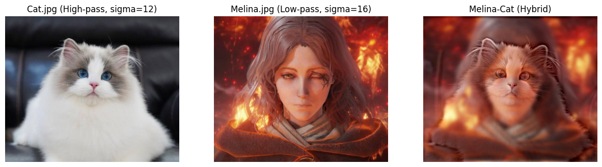
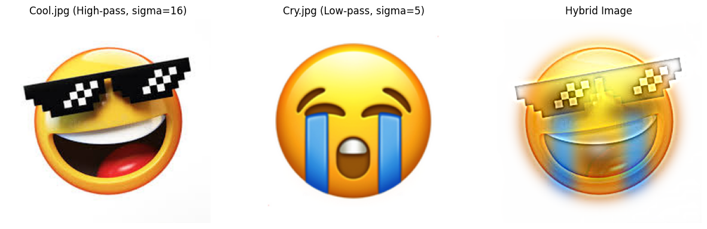
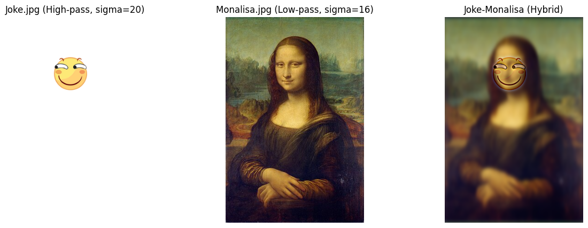

## Multi-resolution Blending and the Oraple journey

### Part 2.3: Gaussian and Laplacian Stacks

    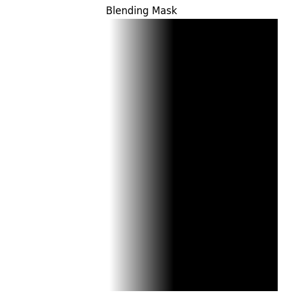

Process:

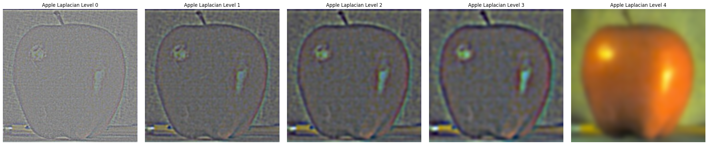
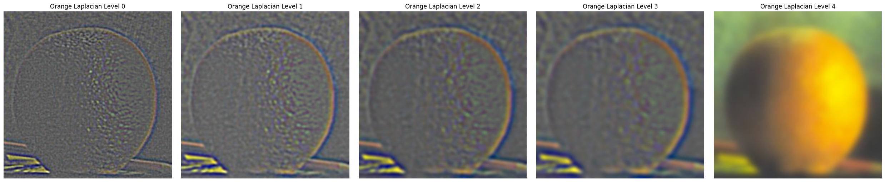
Result:
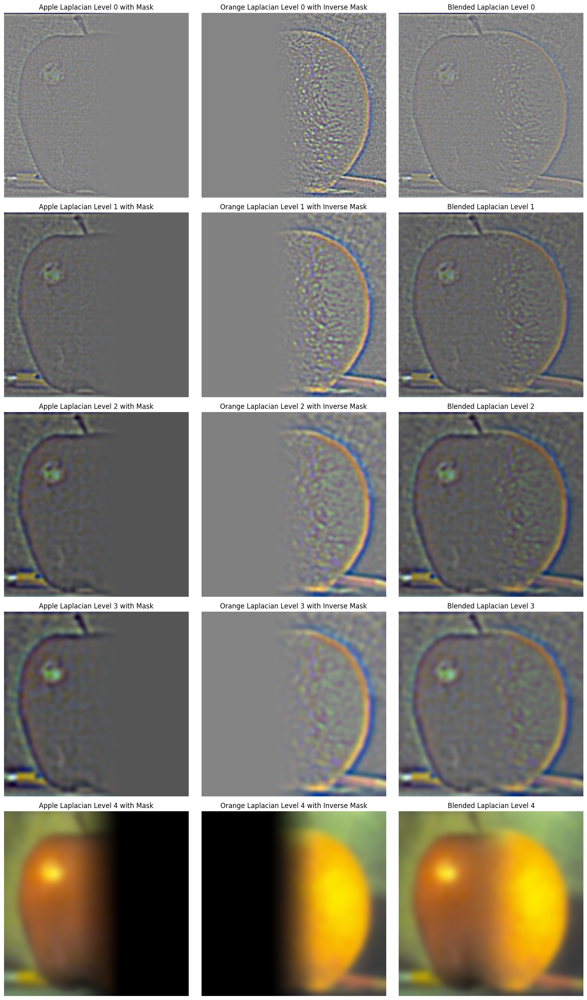
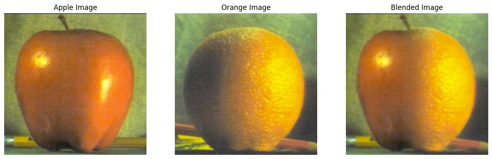

### Part 2.4: Multiresolution Blending

    

        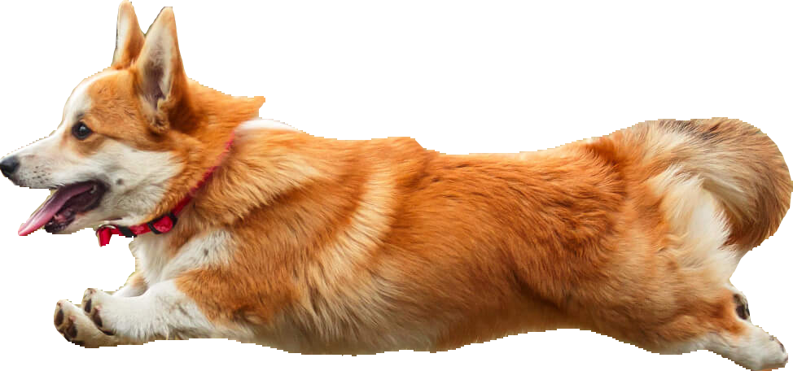
        
dog

    

    

        
        
plane

    

    

        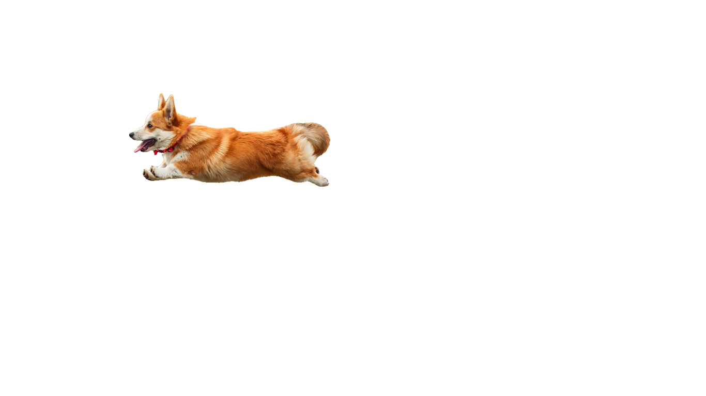
        
dog

    

    

        
        
mask

    

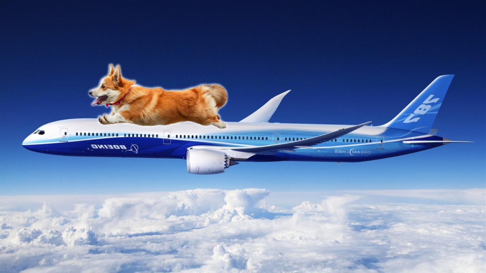

    

        
        
cat

    

    

        
        
cake

    

    

        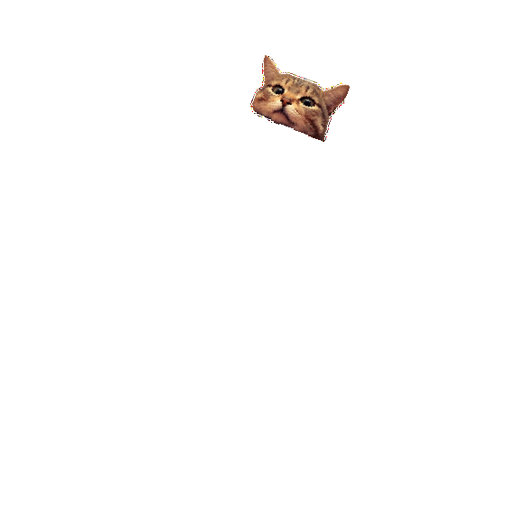
        
cat

    

    

        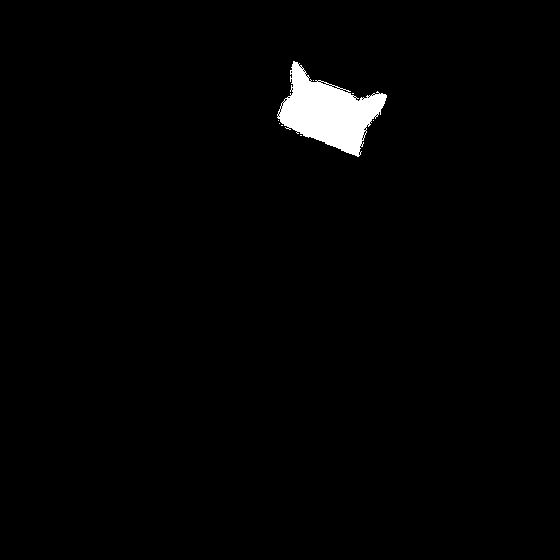
        
mask

    

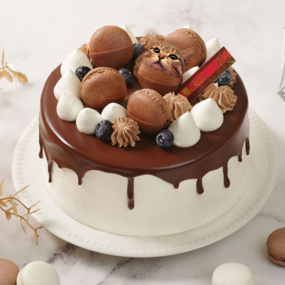