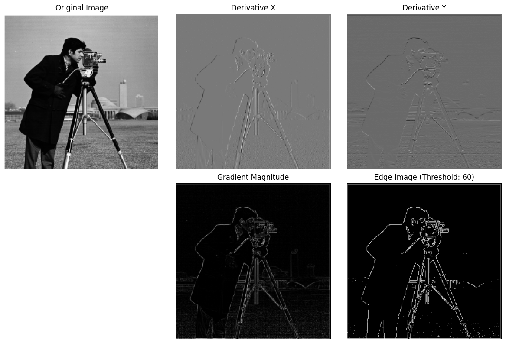
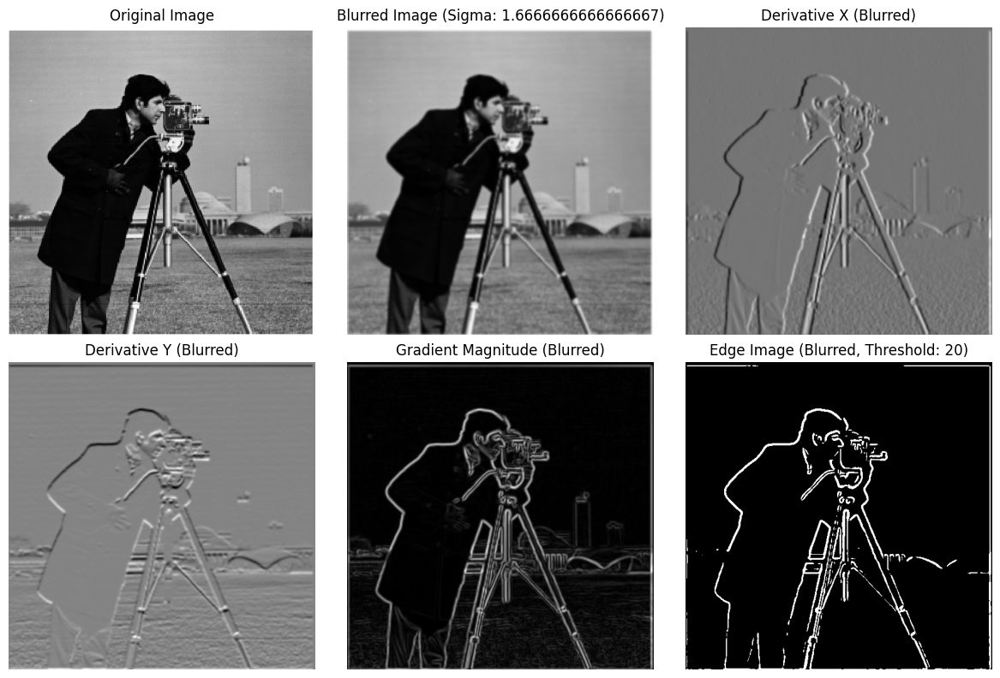
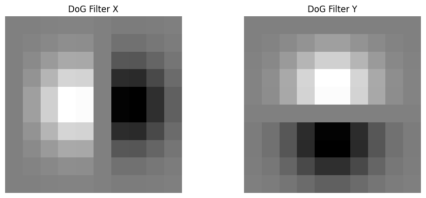
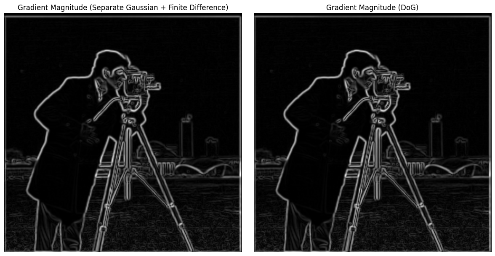
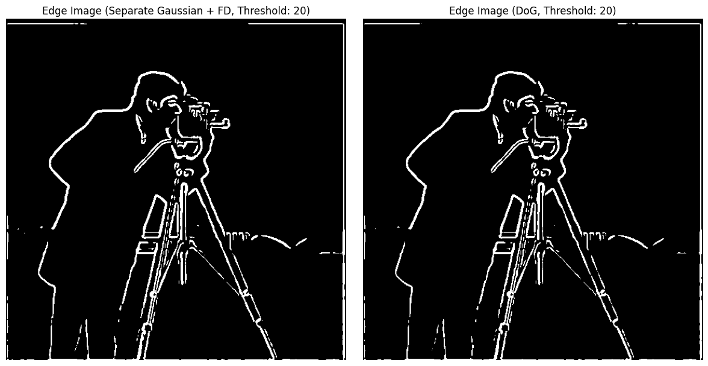
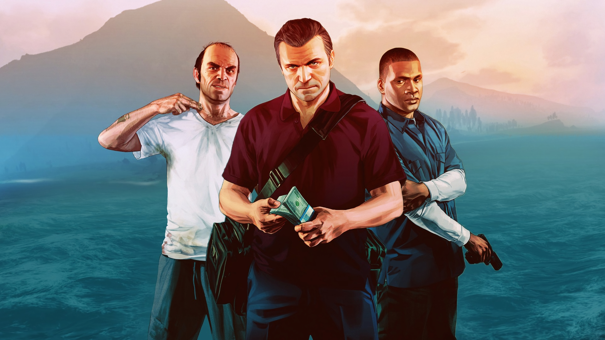
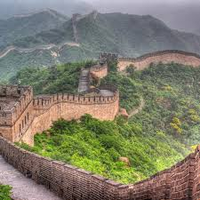
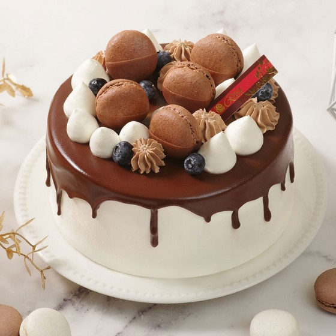

# CS 180 Project 2: Fun with Filters and Frequencies

## Part 1: Fun with Filters
In this part, we will build intuitions about 2D convolutions and filtering.

### Part 1.1: Finite Difference Operator

We will begin by using the humble finite difference as our filter in the x and y directions.

\[D_x = \begin{bmatrix}
1 & -1
\end{bmatrix},\ \ 
D_y = \begin{bmatrix}
1 \\
-1
\end{bmatrix}\]

The Finite Difference Operator estimates image gradients by computing horizontal and vertical derivatives, which reveal intensity changes, indicating edges. It uses simple kernels to calculate these derivatives through convolution, and the gradient magnitude is derived by combining both directions. However, this method is sensitive to noise, as it directly processes raw pixel values. Edges are detected by thresholding the gradient magnitudes, making it a straightforward but noise-prone approach for edge detection. After multiple adjustments to the threshold and implementations, I found that the best result was achieved with a threshold of 60.

### Part 1.2: Derivative of Gaussian (DoG) Filter
Firstly, create a blurred version of the original image by convolving with a gaussian and repeat the procedure in the previous part (using `cv2.getGaussianKernel()` to create a 1D gaussian and then taking an outer product with its transpose to get a 2D gaussian kernel).

The processed image clearly contains less noise and has more distinct edges.

Then, do the same thing with a single convolution instead of two by creating a derivative of gaussian filters (DoG Filter)

These two methods get the same result.

## Part 2: Fun with Frequencies!

### Part 2.1: Image "Sharpening"

    

        
        
GTA5

    

    

        
        
GTA5_blurred

    

    

        
        
GTA5_sharpened

    

    

        
        
GreatWall

    

    

        
        
GreatWall_sharpened

    

    

        
        
Sea

    

    

        
        
Sea_sharpened

    

### Part 2.2: Hybrid Images

## Multi-resolution Blending and the Oraple journey

### Part 2.3: Gaussian and Laplacian Stacks

    

Process:

Result:

### Part 2.4: Multiresolution Blending

    

        
        
dog

    

    

        
        
plane

    

    

        
        
dog

    

    

        
        
mask

    

    

        
        
cat

    

    

        
        
cake

    

    

        
        
cat

    

    

        
        
mask

    

