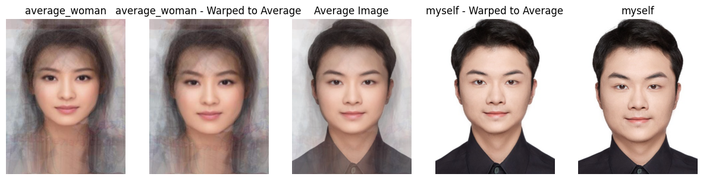

# CS 180 Project 3: Face Morphing
## Part 1: Defining Correspondences
I used the provided online tool to select keypoints for both of myself.jpg and george_small.jpg. I also added the corners of the images as additional keypoints for better performance.

I used `scipy.spatial.Delaunay` to compute the Delaunay triangulation. To ensure that the triangulation of keypoints is consistent between two images, I modified the `plot_delaunay` function to accept an optional triangulation parameter. 
If this parameter is provided, the function will use it to plot the Delaunay.

## Part 2: Computing the "Mid-way Face"

This part we need to align the input image to a set of target points' average positions through an affine transformation. The process consists of the following steps:

1. Triangulation: Perform triangulation on the source points and target points to execute affine transformations within each triangle.
2. Bounding Rectangle Extraction: For each triangle, calculate the minimum bounding rectangle that contains the triangle and extract the image region within this rectangle.
3. Affine Transformation Matrix Calculation: Compute the affine transformation matrix based on the vertices of the source triangle and the target triangle. The affine transformation can be represented as:
$$
\begin{bmatrix}
    x' \\
    y' \\
    1
    \end{bmatrix}
    =
    \begin{bmatrix}
    a & b & 0 \\
    c & d & 0 \\
    0 & 0 & 1
\end{bmatrix}
\begin{bmatrix}
    x \\
    y \\
    1
\end{bmatrix}
$$
4. Applying Affine Transformation: Use `cv2.warpAffine` to apply the affine transformation to the extracted rectangular image region, yielding the transformed image region.
5. Mask Generation and Composition: Create a mask for the target rectangular region to ensure that only the transformed area is composed into the corresponding position of the target image.

- The matrix form of affine transformation: $$tx$$ and $$ty$$ are the translation vectors.
$$
\begin{bmatrix}
x' \\
y'
\end{bmatrix}
=
\begin{bmatrix}
a & b \\
c & d
\end{bmatrix}
\begin{bmatrix}
x \\
y
\end{bmatrix}
+
\begin{bmatrix}
tx \\
ty
\end{bmatrix}
$$ 

- Calculation of the bounding rectangle coordinates: $$i = 1, 2, 3$$ represents the three vertices of the triangle.
$$
\text{src_rect} = \left(\min(x_i), \min(y_i), \max(x_i) - \min(x_i), \max(y_i) - \min(y_i)\right)
$$

## Part 3: The Morph Sequence
Using a range of weights in [0, 1] I created a morph sequence:

## Part 4: The "Mean Face" of a population
I used FEI [Face Database](https://fei.edu.br/~cet/facedatabase.html) with 200 faces to compute the average face.

Here is 10 example of the dataset:

Then I computed the average keypoints on the whole dataset (200 faces).

After that, I performed the warping operation to the examples and transform them to the shape of the average face:

Finally, I got the average face of the 200 faces.

I also performed the same operation to my own face with the average face:

1. The second image below is my face warped into the average geometry.
2. The fourth image below is the average face warped into my geometry.

## Part 5: Caricatures: Extrapolating from the mean
Produced a caricature of my face by extrapolating from the population mean I calculated in the last step.

I achieved this by choosing $\alpha > 1$, I choosed `alpha=1.5`

## Bells and Whistles: Gender Change

I changed the gender of my face using the average face found on [www.pinterest.com](https://www.pinterest.com/pin/241998179952235711)

