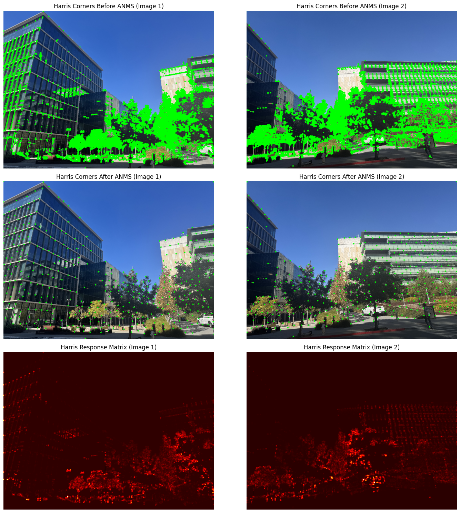
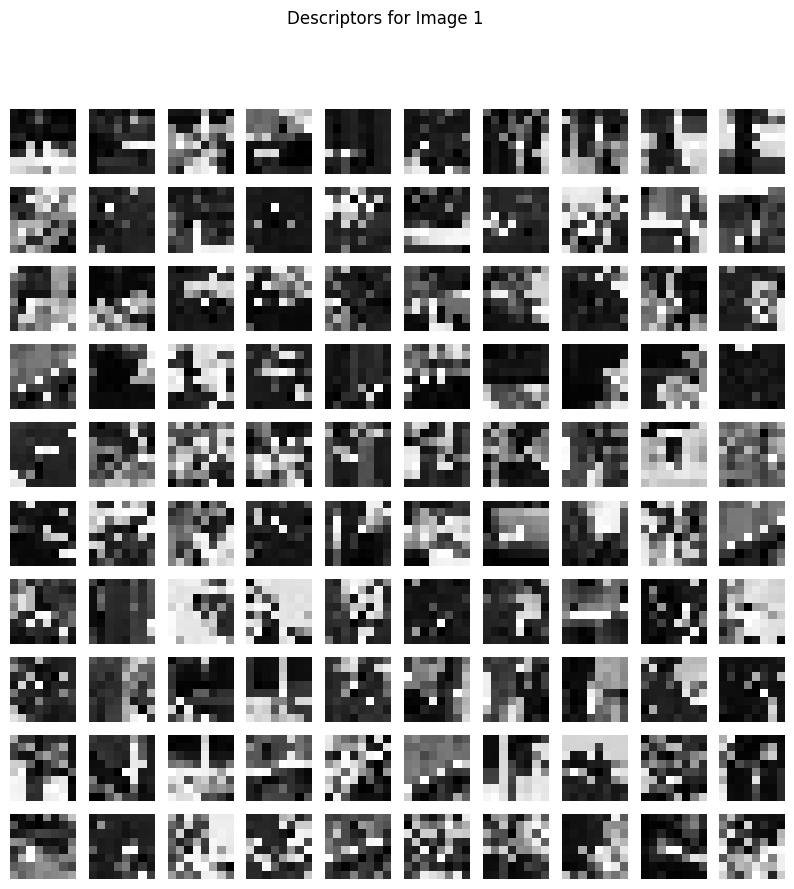
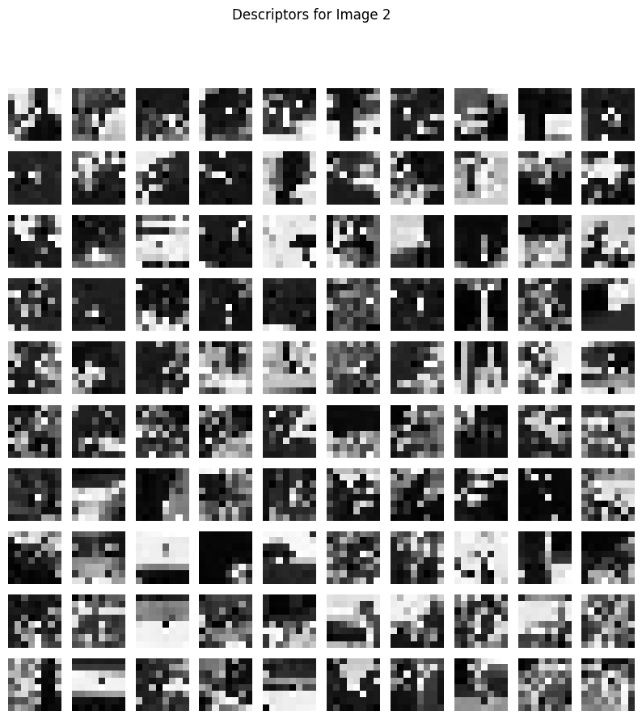
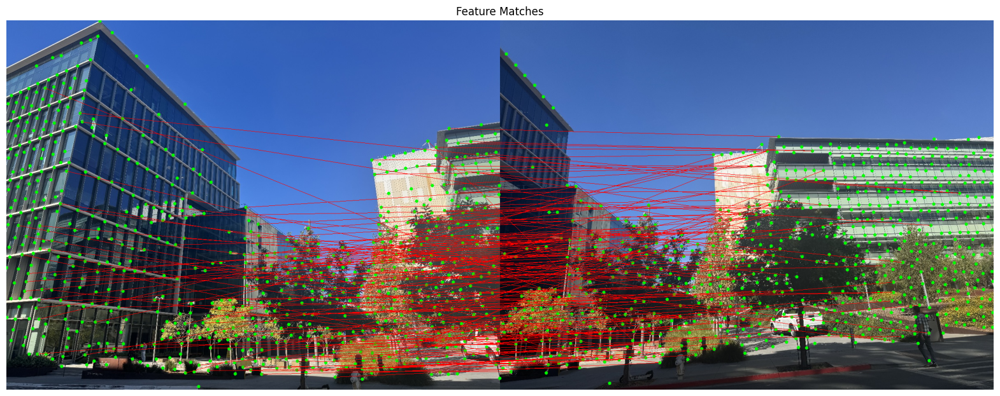
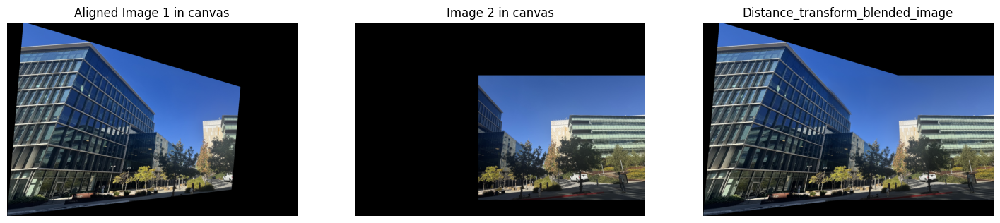
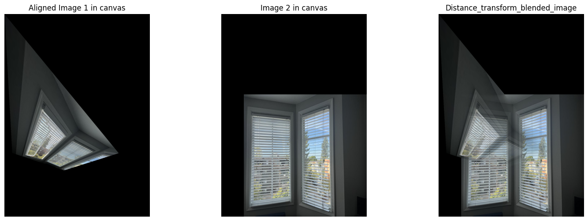

# CS 180 Project 4: Stitching Photo Mosaics
## Part A: Image Warping and Mosaicing
### Step 1: Shoot the Pictures

I took a series of photos of the blinds in my home with an Iphone. The set of blinds covers three windows in total, and I marked the vertices of the middle window as key points.

### Step 2: Recover Homographies

To compute the homography matrix $$H$$, we use the fact that a homography is a 3x3 transformation matrix that relates corresponding points between two images. The homography maps points from one image plane to another under a perspective transformation.

#### 1. Homography transformation formula:

Given a point $$p_1=(x_1,y_1,1)^T$$ n the first image, its corresponding point in the second image $$p_2=(x_2,y_2,1)^T$$ is related by the homography matrix $$H$$ as:

$$\mathbf{p}_2 = H \mathbf{p}_1$$

$$H = \begin{pmatrix} 
h_{00} & h_{01} & h_{02} \\
h_{10} & h_{11} & h_{12} \\
h_{20} & h_{21} & 1
\end{pmatrix}$$

We use homogeneous coordinates to express this transformation. The third coordinate is set to 1 to handle the projective transformation.

#### 2. Homography coordinate transformation:

The relation between the points in homogeneous coordinates is:

$$\begin{pmatrix} x_2 \\ y_2 \\ 1 \end{pmatrix} \sim H \begin{pmatrix} x_1 \\ y_1 \\ 1 \end{pmatrix}$$

which expands to:

$$x_2 = \frac{h_{00} x_1 + h_{01} y_1 + h_{02}}{h_{20} x_1 + h_{21} y_1 + 1}$$

$$y_2 = \frac{h_{10} x_1 + h_{11} y_1 + h_{12}}{h_{20} x_1 + h_{21} y_1 + 1}$$

This transformation is non-linear, so we convert it to a linear system to solve for the homography parameters.

#### 3. Linearization of the system:

$$x_2 (h_{20} x_1 + h_{21} y_1 + 1) = h_{00} x_1 + h_{01} y_1 + h_{02}$$

$$y_2 (h_{20} x_1 + h_{21} y_1 + 1) = h_{10} x_1 + h_{11} y_1 + h_{12}$$

Expanding these results:

$$h_{00} x_1 + h_{01} y_1 + h_{02} - x_2 h_{20} x_1 - x_2 h_{21} y_1 = x_2$$

$$h_{10} x_1 + h_{11} y_1 + h_{12} - y_2 h_{20} x_1 - y_2 h_{21} y_1 = y_2$$

#### 4. Matrix formulation:

We can stack the equations for all corresponding point pairs into a system of equations of the form:

$$A \cdot \mathbf{h} = \mathbf{b}$$

where:
- $$A$$ is the matrix of coefficients formed by the known point coordinates.
- $$h$$ is the vector of unknown homography parameters $$h_{00},h_{01},...,h_{21}$$.
- $$b$$ is the vector of target points' coordinates $$(x_2,y_2)$$.

### Step 3: Warp the Images

  

    <h3>Original Image</h3>
    
  

  

    <h3>Warped Image</h3>
    
  

### Step 4: Image Rectification

Before proceeding further with image blending, I first verify the correctness of the homography transformation using some simple examples.

  

    <h3>Original Image</h3>
    
  

  

    <h3>Warped Image</h3>
    
  

  

    <h3>Original Image</h3>
    
  

  

    <h3>Warped Image</h3>
    
  

### Step 5: Blend the images into a mosaic

#### Method 1: Blend with linear interpolation
Blend two images by linearly combining their pixel values. First create binary masks to indicate where each image has non-zero pixels. The two masks are summed to form a combined mask, which is used to normalize the pixel values in overlapping regions. The pixel values from both images are added and divided by this combined mask. Finally, the result is clipped to ensure pixel values stay within the valid range (0 to 255) and returned as an 8-bit image.

Although this method is very fast and convenient, there will be slight artifacts in the overlapping areas of the two images.

  

    <h3>Aligned Image</h3>
    
  

  

    <h3>Canvas</h3>
    
  

  

    <h3>Linear blended Image</h3>
    
  

#### Method 2: Blend with distance transform

Use a distance transform approach for blending two images, which helps to create a smoother transition in overlapping regions. 

##### 1. Mask Creation:
Two binary masks are created to identify the valid (non-zero) pixel areas of each image. These masks represent regions where the images contain information.

##### 2. Distance Transform:
The distance transform computes the distance of each pixel in the mask to the nearest zero pixel.

$$D(i, j) = \text{min}_{(x, y) \in M} \sqrt{(i - x)^2 + (j - y)^2}$$

##### 3. Normalization of Distance Maps:
The distance maps for both masks are normalized to ensure they range between 0 and 1:

$$D_{\text{norm}}(i, j) = \frac{D(i, j)}{D_{\text{max}} + \epsilon}$$

##### 4. Blending Formula:
The blending of the two images is performed using a weighted average based on the normalized distance transforms:

$$\text{blended}(i, j) = \frac{\text{img1}(i, j) \cdot D_{\text{norm1}}(i, j) + \text{img2}(i, j) \cdot D_{\text{norm2}}(i, j)}{D_{\text{norm1}}(i, j) + D_{\text{norm2}}(i, j) + \epsilon}$$

##### 5. Clipping:
Finally, the blended image is clipped to ensure that pixel values remain within the valid range for an 8-bit image (0 to 255):

$$\text{blended}(i, j) = \max(0, \min(\text{blended}(i, j), 255))$$

This ensures the output is suitable for display or further processing.

  

    <h3>Aligned Image</h3>
    
  

  

    <h3>Canvas</h3>
    
  

  

    <h3>Linear blended Image</h3>
    
  

Interesting perspective from the game Horizon 5:

  

    
  

  

    
  

  

    
  

Streets in the game Cyberpunk 2077:

  

    
  

  

    
  

  

    
  

## Part B: Feature Matching for AutoStitching

### Step 1: Harris Response
The Harris response is calculated to detect corners in the image. This involves:

1. Computing image gradients in the x and y directions using the Sobel filter.
2. Squaring these gradients and computing their products.
3. Applying Gaussian blur to these squared gradients and their product.
4. Calculating the determinant and trace of the structure tensor.
5. Using these values to compute the Harris response, which highlights potential corners.

### Step 2: Adaptive Non-Maximal Suppression (ANMS)
ANMS is used to select the most prominent corners from the Harris response:

1. Sort the detected corners based on their response values.
2. Iteratively select corners that are not too close to already selected ones, ensuring a minimum distance between them.
3. This reduces the number of corners while retaining the most significant ones.

### Step 3: Feature Descriptor
Feature descriptors describe the local appearance around each detected corner:

1. Extract a patch of pixels around each corner.
2. Apply Gaussian blur to reduce noise.
3. Resize the patch to a smaller, fixed size.
4. Normalize the patch to have zero mean and unit variance.
5. This normalized patch serves as the feature descriptor for matching.

  

    
  

  

    
  

### Step 4: Feature Matching
Feature matching finds correspondences between feature descriptors from two images:

1. Compute distances between all pairs of descriptors.
2. Select pairs with the smallest distances.
3. Apply a ratio test to ensure the best match is significantly better than the second-best match, reducing false matches.

### Step 5: RANSAC Homography
RANSAC estimates the homography matrix between two sets of matched points:

1. Iteratively select random subsets of matches.
2. Compute the homography matrix for each subset.
3. Determine the number of inliers for each homography matrix.
4. Choose the homography matrix with the highest number of inliers as the best estimate.

### Image Warping and Blending
Image warping aligns one image with another using the estimated homography matrix:

1. Transform the image using the homography matrix.
2. Place the transformed image onto a canvas that can accommodate both images.
3. Use distance transforms to blend the images smoothly, weighting their contributions based on their distances from the overlap region.

The final result is exactly the same as the effect of manually aligning the key points.

**However**, there are a few less ideal results. For example, in the case of blinds, when the scenery outside the window also lacks distinct features, the corner points on the blinds all look almost the same. The algorithm finds it difficult to compute the homography matrix from many similar focal points.

